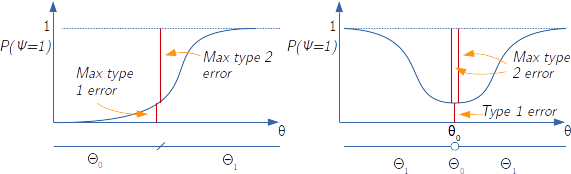

$\newcommand\array[1]{\begin{bmatrix}#1\end{bmatrix}}$

# Notes on Statistics

## 1. Introduction

### Definitions and aims

Probability: Given a data-generation mechanism say everything about the data that would be generated by this mechanism
Statistics: Given observed data, try to understand the mechanism that generated it (e.g. to make prediction, or to infer causality)

- **Sample space** $E$, the sample space of the observed r.v. $X(\omega)$ (so the codomain of X, _not_ its domain $\Omega$)
- **Probability distribution** $p_X(x;\theta)$, the assumed common distribution family of the observed variable
- **Parameter** $\theta$, the specific unknown parameter we want to estimate (NOT a r.v. in the frequentist approach)
- **Statistic**: Any measurable function of the sample, like the sample mean or the sample standard deviation
  - **Sufficient statistics**. The statistics required to achieve a particular scope, like the mean and the standard variation for performing hypothesis testing. The sufficient statistic is a function of the data that holds all information the data x provides with regard to the unknown parameter values.
- **Estimator of $\theta$** $\hat \Theta_n$, f(X), any statistics that doesn't depend on $\theta$. It is a function of a r.V., so it is a r.v. itself
- **Estimate** $\hat\theta_n$, f(x), the specific outcome of $\hat \Theta_n$ we obtain after a concrete statistical experiment
- **Parameter set** $\Theta$, the set of all possible $\hat \theta_n$

- **Statistical experiment**: the sampling of the $X_n$ r.v. from a space $E$ with given distribution $P$
- **Statistical model**: The pair $(E, \{P_\theta\}_{\theta \in \Theta})$ associated with the statistical experiment
  - (1) the sample space, (2) the prob family and (3) the candidate thetas
  - well-specified model: the family is correct and $\theta \in \Theta$, so that the true prob generating the data is indeed in $\{P_\theta\}_{\theta \in \Theta})$
  - identifiable model: only a single, unique set of parameters results in a specific modelled distribution: $P_\theta = P_{\theta'} \implies \theta = \theta' ~~ \forall \theta, \theta' \in \Theta$ - the covariance matrix of the estimator variance would be singular
  - "non-parameteric model": $\Theta \in R^\infty$
  - "semi-parametrci model": $\Theta$ is decomposed in $\theta = \Theta_1 \times \Theta_2$ where $\Theta_1$ is a finite dimensional and $\Theta_2$ is infinite dimensional.
- **Sample mean**: $\bar X_n = \frac{1}{n} \sum_{i=1}^n x_i$
- **Sample variance**: $S_n = \frac{1}{n} \sum_{i=1}^n (x_i - \bar X_n)^2$ $= (\frac{1}{n} \sum_{i=1}^n x_i^2) - \bar X_n^2$
  - unbiased sample variance $\tilde S_n  = \frac{n}{n-1} S_n = \frac{1}{n-1}\sum_{i=1}^{n}(x_i -\bar X_n)$
- **Probability Simplex** in K dimensions: the set of vectors of K elements $\in[0,1]$ and that sums to 1.
- **Pivotal statistics**: a statistics (so it depends from the data) that has a distribution that doesn't depend from unknown parameters, i.e. the CLT $\frac{\sqrt{n} (\bar X_n - \mu)}{\sigma}$ is pivotal as it is distributed following a standard normal.


### Types of problems in classical statistics
- Hypothesis testing: binary answers
  - $H_0: \theta = k_1; ~ H_1: \theta = k_2$
  - $H_0: \theta = k_1; ~ H_1: \theta \neq k_1$
- Parameter estimation
  - design estimator $\hat \Theta$ such to minimise the error($\hat \theta - \theta$), whatever this means. The aim is to find this estimator, its distribution, its error, find the coefficient intervals


### Properties of an estimator Θₙ

Note that for any estimator we have: $E[\hat \Theta_n] = \sum_{x_1 \in E} \sum_{x_2 \in E}, ..., \sum_{x_n \in E} \hat \Theta(x_1, x_2, ..., x_n) p_X(x_1,x_2,...,x_n;\theta)$

- **consistent** $\hat \Theta_n \xrightarrow{\text{p./a.s.}} \theta ~ \forall \theta$, e.g. $P(|\hat \Theta_n - \theta| \geq \epsilon) = 0 ~~ \forall \epsilon > 0, \forall \theta \in \Theta$
  - in both cases the variance of the estimator tends to 0

- **unbiased** $E[\hat \Theta_n] = \theta ~~ \forall \theta \in
 \Theta$
   - **bias**: $E[\hat \Theta_n - \theta] = E[\hat \Theta_n] - \theta$
   - if the estimator is consistent the bias reduces with $n$

- **Mean Square Error** $E[(\hat \Theta_n - \theta)^2]$ (one possible measure of error)
  - MSE = $E[\hat \theta_n - E[\hat \theta_n]] - (E[\hat \theta_n - \theta])^2 = var(\hat \theta_n) + (bias(\hat \theta_n))^2$
  - in general it can depend on $\theta$
  - also known as the **quadratic risk**
  - minimising it I minimise both components (var and bias sq.), as these are non-negative
  - in multiple dimension it is the expectation of the l-2 norm of the difference between $\hat \Theta_n$ and $\theta$

- **Standard error** $\sqrt{var(\hat \Theta_n)}$
  - for the sample mean we know (CLT) that $\text{st.error}(\hat \mu) = \sigma_X / \sqrt{n}$

- **Efficiently computable**: If it can be analytically computed (closed form) from the data (instead of only numerically computed)


## 2. Delta method

Limit of difference between function of random variable at the limit

Extends the Continuous Mapping Theorem of (continuously differentiable) functions of r.v. for r.v. that converge to a normal to determine that also the function of such r.v. converges to a normal with a known variance.

The CMT tell us that if $x \to a$ (in probability or as almost sure) then $g(x) \to g(a)$, and in particular for the sample mean LLN tells that $\bar X_n \to \mu$, so $\hat \theta = g(\bar X_n) \to \theta=g(\mu)$.

ATTENTION!: This doesn't mean that if a r.v. $X$ has a distribution with a certain mean $\mu$, a function of it $g(X)$ has a distribution with mean $g(\mu)$, i.e. $E[g(X)] \neq g(E[X])$

The delta method extend this relation to the variance for assimtotically normal statistics:

$S \xrightarrow[n \to \infty]{} N \sim (\mu_s, \sigma^2_s) \implies g(S) \xrightarrow[n \to \infty]{} N \sim (g(\mu_s), (g'(\mu_s))^2 \sigma^2_s)$

In particular for the sample mean we know that the CLT postulate its asintotical normality, so:

$\bar X_n \xrightarrow[n \to \infty]{} N \sim (\mu, \frac{\sigma^2}{n}) \implies \hat \theta := g(\bar X_n) \xrightarrow[n \to \infty]{} N \sim (\theta := g(\mu), \left( \frac{\partial g(\mu)}{\partial \mu} \right)^2 \frac{\sigma^2}{n})$

The Delta model applies similarly to multivariate random variables: 

$X_n \xrightarrow[n \to \infty]{} N_d \sim (\mu, \frac{\Sigma_d}{n}) \implies g(X_n) \xrightarrow[n \to \infty]{} N_k \sim (g(\mu), \frac{Jg(\mu) \Sigma_d Jg(\mu)'}{n})$
Where  $X_n, \mu \in R^d$, $g(X_n): R^d \mapsto R^k$ and $Jg(\mu)$ is the $k \times d$ Jacobian.

### Exponential example

In a exponential r.v. $X$ the parameter $\lambda$ can be seen as a function of the expectation: $\lambda = g(\mu) = \frac{1}{\mu}$. Also the variance of $X$ is equal to the square mean.

By applying the delta method we find that:

$\hat \lambda = \frac{1}{\bar X_n} \to \sim N (\lambda = \frac{1}{\mu}, \left( \frac{\partial \frac{1}{\mu}}{\partial \mu} \right)^2 \frac{\mu ^2}{n}) = N(\frac{1}{\mu}, \frac{1}{\mu^2 n})$

- consistent but biased, as $E[1/X] > 1/E[X]$ for Jernseen inequality

## 3. MLE

### Total Variation distance

The largest deviance between two probability distribution I can incur over all possible events.

$TV(P_θ,P_{θ'})=max_{A⊂E}∣P_θ(A)−P_{θ'}(A)∣$
Can be rewritten as distance between PMFs/PDFs: $TV(P_θ,P_{θ'})=\frac{1}{2}\sum_{x \in E} |p_{X;\theta}(x) - p_{X;\theta'}(x) )∣$ $=\frac{1}{2}\int_{x \in E} |f_{X;\theta}(x) - f_{X;\theta'}(x)| dx$

Properties (such that it can considered a "distance" between probability distributions):
- **symmetric**: $TV(P_θ,P_{θ'}) = TV(P_{θ'},P_θ)$
- **positive**: $TV(P_θ,P_{θ'}) \geq 0$ (but also $TV(P_θ,P_{θ'}) \leq 1$)
- **definite**:  $TV(P_θ,P_{θ'}) = 0 ~ \Rightarrow  ~ \theta = \theta'$
- **triangle inequality**: $TV(P_θ,P_{θ'}) \leq TV(P_θ,P_{θ''}) + TV(P_{θ''},P_{θ'})$

The "distance" however is only strictly vertical, it doesn't account even for minimal differences in the value of the r.v. (i.e. "horizontal movements"), so e.g. TV(discr. r.V., continuous r.v.) is always 1.

### Kullback-Leibler (KL) Divergence (aka "relative entropy")

$KL(P_θ,P_{θ'}) = \sum_{x \in E}  p_{X;\theta}(x) ln \left( \frac{p_{X;\theta}(x)}{p_{X;\theta'}(x)} \right)$ $= \int_{x \in E}  f_{X;\theta}(x) ln \left( \frac{f_{X;\theta}(x)}{f_{X;\theta'}(x)} \right) dx$

Properties (a "divergence", no longer a "distance" between probability distributions):
- **positive**: $KL(P_θ,P_{θ'}) \geq 0$
- **definite**:  $KL(P_θ,P_{θ'}) = 0 ~ \Rightarrow  ~ \theta = \theta'$

-> not symmetric and triangle inequality property doesn't hold

$\theta^*$ is the unique minimizer of the function that maps $\theta \to KL(P_{\theta^*},P_\theta)$

KL divergence can be seen as an expectation when we consider the function $g(x;\theta^*,\theta) = ln\left(\frac{p_{X;\theta^*}(x)}{p_{X;\theta}(x)} \right)$ such that $KL(P_{θ^*},P_θ) = E[ln\left(\frac{p_{X;\theta^*}(x)}{p_{X;\theta}(x)} \right)]$ where $\theta^*$ is the real parameter and $\theta$ is the parameter we are trying to move in order to milimize the divergence. In other words we consider KL as $KL(\theta;\theta^*,p)$.

$KL(P_θ^*,P_{θ}) = \sum_{x \in E}  p_{X;\theta^*}(x) ln \left( \frac{p_{X;\theta^*}(x)}{p_{X;\theta}(x)} \right) = E[ln\left(\frac{p_{X;\theta^*}(x)}{p_{X;\theta}(x)} \right)]$ $\xrightarrow{n \to \infty}$ $\hat KL(P_θ^*,P_{θ}) = \text{const} - \sum_{i=1}^n ln(p_{X;\theta}(x))$

Note that the term denoted "const" is not constant in the sense of nor being random (it is), but in terms of not being dependent on the parameter we are trying to find, $\theta$.

$argmin_\theta (KL(P_θ^*,P_{θ})) = argmax_\theta (\sum_{i=1}^n ln(p_{X;\theta}(x))) = argmax_\theta (\prod_{i=1}^n p_{X;\theta}(x_i))$

Note that the LLN "guarantees" the convergence on the y axis (the value of the divergence), but this translates on the x-axis (the value of the parameter).

The first derivative of the lL function with respect to the parameter is called the **score function**.

### Parameter estimation from the likelihood

**Likelihood of a sample set**: the product of the PMFs evaluated at the Xis: $\prod_{i=1}^n p_{X;\theta}(x_i)$. Takes a sample, a distribution family and a candidate distribution parameter and returns how likely it is that the data was generated by the given specific distribution.

Likelihood, in general, can be defined for not necessarily independent random variables.

Very general method, don't require the problem to have a particular structure to exploit

Can be derived by estimating how far a candidate distribution is from the one that generated the data.

Pick θ such that the probability to have obtained the observed data is maximised, $\hat \theta_n^{MLE} = argmax_{\theta} ~ \prod_{i=1}^{n} (P_{\theta;X}(\theta;x_i))$

Correspond to Bayesian estimation using a uniform as prior distribution.

Limitations of MLE:
 - computational intractability (often the maximisation is done in numerical ways rather than analytically)
 - lack of robustness to partially corrupted data.


### Properties of ML estimators.

**Fisher Information**
- _def_: the covariance of the gradient of the log-likelihood of a single observation: $I(\theta) := cov(∇lL(\theta)) := E[∇lL(\theta) (∇lL(\theta))'] - E[∇lL(\theta)]E[∇lL(\theta)'$
- _theorem_: the Fisher information is equal to the negative of the expected value of the Hessian of the log-likelihood of a single observation: $I(\theta) = -E[HlL(\theta)]$
  - in $\theta \in R$: $I(\theta) = E \left[ \left( \frac{ \frac{df(x,\theta)}{d\theta}}{f(x,\theta)} \right)^2 \right]$ = $\int \frac{\left(\frac{df(x,\theta)}{d\theta}\right)^2}{f(x,\theta)} dx$
- _theorem_: the Fisher information is equal to the inverse of the asymptotic covariance of the estimator $\hat \theta$

Attention!: you can't substitute the parameter in the Fisher information matrix with a function of it if the r.v. is parametrized with such function, e.g. the $I(p)$ of a $X \sim Bern(p^2)$ is NOT $\frac{1}{p^2(1-p^2)}$ but $\frac{4}{(1-p^2)}$.
This is because if the barameter for which we want to comput the Fisher information matrix is $p$, and not $p^2$, we need to compute the derivative with respect to $p$, and not $p^2$.
Note that we could still apply in thic case the delta method and retrieve the Fisher information matrix by multiplicating the original fisher information matrix by the square of the derivative of the transformation funciton, i.e. in this case $\frac{4}{(1-p^2)} = \left( \frac{\partial(p^2)}{\partial p} \right)^2 * \frac{1}{p^2(1-p^2)}$


An higher Fisher Information at the true parameter $I(\theta^\star)$ means that with such realities I have an easier task in estimating the parameter(s) compared to realities where the true parameter has a lowed Fisher Information, like estimating $\lambda$ from a (true) $Expon(0.01)$ is much easier than from an $Expon(10)$  

**Asymptotic Normality of MLE**

Given:
- the model is well-defined, and in particular the parameter is identifiable
- the support of the r.v. doesn't depend on θ (e.g., no Unif(0,b))
- $\theta^\star$ is not on the boundary of $\Theta$
- $I(\theta)$ in invertible in a neighborhood of $\theta^\star$

$\hat \theta_n^{MLE} \xrightarrow[n \to \infty]{(d)} N_d (\theta^\star,\frac{I(\theta^\star)^{-1}}{n})$

Advantages of MLE:
- Cramér-Rao lower bound: MLE has the lowest variance (and hence quadratic risk) of any possible unbiased estimator.
- MLE is robust to mis-specifications of the model as it still trying to minimise the KL divergence


Given that the data is i.i.d., under mils assumtions the ML estimator is:

- consistent $\hat \Theta_n \to \theta$

- absintotically Normal (like the CLT postulate for the sample mean): $\frac{\hat \Theta_n - \theta}{\sigma_{\hat \Theta_n}} \sim N(0,1)$
  - Note that the denominator is the standard deviation of the estimator itself, i.e. the standard error, and methods exists to compute it analytically or by simulation
  - can be used to compute Coefficient Intervals

MLE Estimators

|                      | lL |               $\theta$                            |    $I$         |
| -------------------- | - |----------------------------------------- | ----------- |
| $Bern(p)$            | $\sum_{i=1}^n (x_i) ln(p) + (n-\sum_{i=1}^n x_i) ln(1-p)$  | $\hat p_m = \frac{\sum_{i=1}^m x_i}{m}$  |  $I(p) = \frac{1}{p(1-p)}$  |
| $Binom(n,p)$         | | $\hat p_m = \frac{\sum_{i=1}^m x_i}{mn}$ | $I(p) = \frac{n}{p(1-p)}$ | 
| $Multinomial(p_1,p_2,...,p_k)$         | | $\hat p_k = \frac{n_k}{n}$  |
| $Poisson(\lambda)$   | $\sum_{i=1}^n  (x_i) * ln(\lambda) -n\lambda -\sum_{i=1}^n  x_i !$ | $\hat \lambda_n = \frac{\sum_{i=1}^n x_i}{n}$ |
| $N(\mu,\sigma^2)$    | $-\frac{n}{2}ln(2\pi \sigma^2) - \frac{\sum_{i=1}^n (x_i - \mu)^2}{2 \sigma^2}$| $\hat \mu_n = \sum_{i=1}^n \frac{x_i}{n} \\ \hat \sigma_n^2 = \sum_{i=1}^n \frac{1}{n} (x_i - \bar x)^2$ | |
| $Expon(\lambda)$   | $n * ln(\lambda) - \lambda \sum_{i=1}^n  (x_i)$ | $\hat \lambda_n = \frac{n}{\sum_{i=1}^n x_i}$ | $I(\lambda) = \frac{1}{\lambda^2}$ |
| $Unif(a,b)$   | (L) $\frac{1}{(b-a)^2}*1(min X_i > a))*1(max X_i < b))$ | $\hat a = min(X_i) \\ \hat b = max(X_i)$ |  |


## 4. Natural estimators / Methods of moments

Given a parameter can be expressed as the expectation of a function of a r.v. $\theta = E[g(X)]$, its "natural estimator" is $\hat \theta_n = \frac{1}{n}\sum_{i=1}^n g(X_i)$, where the W.L.L.N. and the continuous mapping theorem guarantee its consistency (convergence in prob.) and the delta method guarantee the asymptotic normality.

Applicable only when a parameter can be expressed as an expectation

Two different cases here:

1) Natural estimator: the parameter can be expressed as the expectation of a function of a r.v. $\theta = E[Y = g(X)]$:
$\hat \theta_n = \frac{\sum_i y_i = g(x_i)}{n} \xrightarrow[n \to \infty]{LLN} E[Y = g(X)]$
2) Continuous mapping theorem: The unknown parameter can be expressed as a function of the expectation $\theta = g(E[X])$:
$\frac{\sum_i x_i}{n} \xrightarrow[n \to \infty]{LLN} E[X]$,  
$\hat \theta_n = g(\frac{\sum_i x_i}{n}) \xrightarrow[n \to \infty]{CMT} g(E[X])$  

### Examples

- Sample mean: $\mu = E[X] \Rightarrow \hat \mu = \bar X_n = \frac{1}{n}\sum_{i=1}^n X_i$
- Variance: $var(X) = E[(X-E[X])^2] \Rightarrow \hat {var}(X)  = \frac{1}{n}\sum_{i=1}^n (X_i-E[X])^2 \approx \frac{1}{n}\sum_{i=1}^n (X_i-\bar X_n)^2$
  - This is the estimator of the variance, not to be confused with the variance of the estimator of the mean
- Covariance: $cov(X,Y) = E[(X-E[X])(Y-E[Y])] \Rightarrow \hat {covar}(X,Y) = \frac{1}{n}\sum_{i=1}^n (X_i-E[X]) (Y_i-E[Y]) \approx \frac{1}{n}\sum_{i=1}^n (X_i-\bar X_n) (Y_i-\bar Y_n)$

$\theta = E[g(X)] \Rightarrow g(\bar X_n) \xrightarrow{d} \sim N(g(E[X]),\frac{(g'(E[X]))^2 \sigma_X^2}{n})$


### Methods of moments
- differently from MLE if the model is mis-specified the estimates are completely wrong

LLN: $\frac{1}{n}\sum_{i=1}^n g(X) \xrightarrow{d} E[g(X)]$

And, in particular:
$\hat m_k = \frac{1}{n}\sum_{i=1}^n X_n^k \xrightarrow{d} E[X^k] := m_k$

The idea is to see the moments (or, more in general the $g_i(X)$) as function of the parameters and then to retrieve the estimators as the inverted function of these moments that we know how to estimate:
- $\theta \mapsto M(\theta) = (m_1(\theta),m_2(\theta),...,m_d(\theta))$ ⇒ $\theta = M^{-1}(m_1,m_2,...,m_d)$ $\hat \theta = M^{-1}(\hat m_1,\hat m_2,..., \hat m_d)$


**CLT for moments**

$\hat M := \begin{bmatrix}\frac{\sum g_1(x)}{n} \\ \frac{\sum g_2(x)}{n} \\ ... \\ \frac{\sum g_d(x)}{n} \end{bmatrix} \xrightarrow{(d)} \sim N( M := \begin{bmatrix} E[g_1(x)] \\ E[g_2(x)] \\ ... \\ E[g_d(x)] \end{bmatrix}, \frac{Cov(g(x))}{n})$

Note that here we do not need yet the delta method as the above equation is simply the CLT theorem expressed for the r.v. $g_1(x)$, $g_2(x)$, etc..

We do need to use the delta method however when we express the CLT in terms of the inverse functions of $M(\theta)$:

$\hat \theta = M^{-1}(\hat m_d) \xrightarrow{(d)} \sim N(
M^{-1}(M(\theta)), \frac{(∇M^{-1})' Cov(\theta) ∇M^{-1} }{n}
)$

### My interpretation of (generalised) method of moments

**Case #1: the estimator can be expressed as the expected value of a function of X**
- $\theta = E[g(X)]$, $G = g(X)$, $\bar G_n = \frac{1}{n} \sum_{i=1}^n g(x_i)$
- by LLN applied on $g(X)$ we have: $\hat \theta_n := \bar G_n \xrightarrow{(p/d)} \theta := E[G]$
- by CLT applied to $g(X)$ we have: $\hat \theta_n := \bar G_n \xrightarrow{(d)} \sim N(E[G],\frac{var(G)}{n})$

**Case #2: the estimator can be expressed as a function of the expected value of a function of X**
- $\theta = h(E[g(X)])$, $G = g(X)$, $\bar G_n = \frac{1}{n} \sum_{i=1}^n g(x_i)$
- by LLN applied on $g(X)$ and the CMT we have: $\hat \theta_n := h(\bar G_n) \xrightarrow{(p/d)} \theta := h(E[G])$
- by CLT applied to $g(X)$ and the delta method we have: $\hat \theta_n := h(\bar G_n) \xrightarrow{(d)} \sim N \left(h(E[G]),\frac{\left( \frac{dh}{dE[G]} \right)^2 var(G)}{n}\right)$

**Case #3: the estimators can be expressed as D functions of K multiple expected values of functions of X**
- $\theta = \{h_1(E[g_1(X)],E[g_2(X)],...,E[g_K(X)]), h_2(E[g_1(X)],E[g_2(X)],...,E[g_K(X)]),...,h_D(\cdot)\}$ with $1 \leq K \leq D$
- $G_k = g_k(X)$, $\bar G_{k,n} = \frac{1}{n} \sum_{i=1}^n g_k(x_i)$, $J(H)$ is the $D \times K$ matrix of the $\frac{dh_d}{dE[g_d(X)]}$ derivatives, and $Cov(G)$ is the $D \times D$ covariance matrix between the $g_d(x)$ random variables
- by LLN applied on $g_k(X)$ and the CMT we have:
$\hat \theta_n :=
\begin{bmatrix}
h_1(\bar G_{1,n}, \bar G_{2,n}, ..., \bar G_{K,n}) \\
h_2(\bar G_{1,n}, \bar G_{2,n}, ..., \bar G_{K,n}) \\
... \\
h_D(\bar G_{1,n}, \bar G_{2,n}, ..., \bar G_{K,n}) \\
\end{bmatrix}
\xrightarrow{(p/d)} \theta :=
\begin{bmatrix}
h_1(E[G_1], E[G_2], ..., E[G_K]) \\
h_2(E[G_1], E[G_2], ..., E[G_K]) \\
... \\
h_D(E[G_1], E[G_2], ..., E[G_K]) \\
\end{bmatrix}$
- by CLT applied to $g(X)$ and the delta method we have:
$\hat \theta_n :=
\begin{bmatrix}
h_1(\bar G_{1,n}, \bar G_{2,n}, ..., \bar G_{K,n}) \\
h_2(\bar G_{1,n}, \bar G_{2,n}, ..., \bar G_{K,n}) \\
... \\
h_D(\bar G_{1,n}, \bar G_{2,n}, ..., \bar G_{K,n}) \\
\end{bmatrix}
\xrightarrow{(d)} \sim N_D \left(
\begin{bmatrix}
h_1(E[G_1], E[G_2], ..., E[G_K]) \\
h_2(E[G_1], E[G_2], ..., E[G_K]) \\
... \\
h_D(E[G_1], E[G_2], ..., E[G_K]) \\
\end{bmatrix}
,\frac{ J(H) ~Cov(G) ~(J(H))' }{n}\right)$


Note that the above equations are already placed in the direct format where the individual parameters depends only from the moments.
To arrive there we need often to solve a system of D equations in D unknown (the parameters to estimate) where the original equation of the parameter depends form the moments but also from the other parameters.
Let's take the case the example of a shifted exponential:

$X ~ exp(\lambda,a) \to f_{X;\lambda,a} = \lambda e^{-\lambda(x-a)}$ with $x>a$

Then we have:

- $m_1 = E[X] \to \hat m_1 = \frac{\sum_i x_i}{n}$
- $m_2 = E[X^2] \to \hat m_2 = \frac{\sum_i x_i^2}{n}$

- $a = \theta_1 = h_1(m_1,\theta_2) = m_1 - 1/\lambda$
- $\lambda = \theta_2 = h_2(m_1,m_2) = \frac{1}{\sqrt{m_2-(m_1)^2}}$

From the previous 2 equation we can "solve" by sustitution obtaining:

- $a = \tilde h_1(m_1,m_2) = m_1 - \sqrt{m_2-(m_1)^2}$
- $\lambda = \tilde h_2(m_1,m_2) = \frac{1}{\sqrt{m_2-(m_1)^2}}$

From these we can finally find the estimators:

$\hat a \to \frac{\sum_i x_i}{n} - \sqrt{\frac{\sum_i x_i^2}{n}-(\frac{\sum_i x_i}{n})^2}$
$\hat \lambda \to \frac{1}{\sqrt{\frac{\sum_i x_i^2}{n}-(\frac{\sum_i x_i}{n})^2}}$

To find their covariance we would have first to compute $cov(G) = cov(X,X^2)$ and the Jacobian of the two $(\tilde h_1, \tilde h_2)$ functions with respect to the $m_1$ and $m_2$ moments, compute $\frac{J*Cov(G)*J'}{n}$ and then replace the two moments and $\lambda$ with their expectations (the parameter $a$ should not be included in the variance).

The "generalised" in the title stand from the fact that the $g(X)$ equation that we want our parameter to be a function of, doesn't necessarily need to be a moment ($x^k$), but can be any (continuous) function so that we can estimate it as $\frac{\sum_i g(x_i)}{n}$.

## 5. M-estimation
Allows to estimate some parameters like mean, variance, quantiles (incl median) without assuming a specific statistical model.

$\theta^{ME} = argmin_\theta ~ Q(\theta) := E[g(X,\theta)]$
$\hat \theta^{ME} = argmin_\theta \frac{\sum_i g(x_i,\theta)}{n}$

It generalise the MME as the $g$ function (known in this context as the **loss function**) generalises the specific $KD$ divergence in MME.

As for method of moments we may think to the expected value of a function of data and the parameter of interest $E[g(X, \theta)]$ and we know how to estimate this guy and the properties of this estimate:

$\frac{1}{n} \sum_{i=1}^n g(x_i, \theta) \xrightarrow{(d)} \sim N(E[g(X, \theta)],\frac{var(g(X,\theta))}{n})$

In the method of moments the estimator was either this quantity itself or a function of it.
Here we are interested instead to the parameter that minimise $Q$ and to retrieve its properties. Note that this is a parameter of the function that we define here $g(x, \theta)$, not a parameter of the distribution function of X, for which we make not assumptions here.
We assume a one to one relation between the argmin of $E[g(X,\theta)]$ and its value (i.e. a unique minimum) so that when $\frac{1}{n} \sum_{i=1}^n g(x_i, \theta) \xrightarrow{(d)} E[g(X, \theta)]$ we have $\hat \theta  := argmin_\theta \frac{1}{n} \sum_{i=1}^n g(x_i, \theta) \xrightarrow{(d)} argmin_\theta E[g(X, \theta)]$

Commonly used M-estimators
- `check(x,α) = x >=0 ? α * x : - (1- α) * x`
- `huberLoss(x,δ) = abs(x) < δ ? x^2/2 : δ*(abs(x)-δ/2)`

- $g(x, \theta) = (x - \theta)^2$ ⇒ argmin = E[x]
  - or $g(x, \theta) = hubberLoss(x - \theta,\infty)$
- $g(x \in R^d, \theta \in R^d) = ||x - \theta||_2^2$ (squared l-2 norm) ⇒ argmin = $E[x] \in R^d$
- $g(x, \theta) = abs(x - \theta)$ ⇒ argmin = median
  - or $g(x, \theta) = hubberLoss(x - \theta,\epsilon)$
- $g(x, \theta) = check(x-\theta, \alpha)$ ⇒ argmin = alpha-quantile (with check function `c(x,α) = x >=0 ? α * x : - (1- α) * x` )


Note that the ML estimator is a specific case of M Estimation:
- $\text{M est} = min_\theta \sum_i g(x;\theta)$
- $\text{MLE}   = min_\theta \sum_i -ln(f_{X;\theta}(x;\theta)$


```julia
"""
    mEstimationBruteForce(obs,candidates,lossFunction=abs)

"Solve" m-estimation in 1-D by "brute-force", i.e. by trying all the candidates provided to the function.

"""
function mEstimationBruteForce(obs,candidates,lossFunction=abs)
    score  = +Inf
    θstar = 0
    for c in candidates
      candidateScore = mean(lossFunction.(obs .- c))
      if candidateScore < score
        score = candidateScore
        θstar = c
      end
    end
    return θstar
  end
function findQuantile(obs,α;precision=0.001)
    score  = +Inf
    quantile = 0
    candidates = minimum(obs):precision:maximum(obs)
    for c in candidates
        candidateScore = mean(check.(obs .- c,α))
        if candidateScore < score
            score = candidateScore
            quantile = c
        end
    end
    return quantile
end
obs                 = rand(copy(TESTRNG),Gamma(2,2),50000)
candidates          = 0:0.01:maximum(obs)
medianWithAbs       = mEstimationBruteForce(obs,candidates)
medianWithHuberLoss = mEstimationBruteForce(obs,candidates,x->huberLoss(x,0.0000000001))
meanWithHuberLoss   = mEstimationBruteForce(obs,candidates,x->huberLoss(x,1000))
q0                  = findQuantile(obs,0.2)
```

### Asymptotic Normality of m-estimators

Given:
- there is a unique $\theta^* \in R^D$ minimiser of $E[g(x,\theta)]$
- we call $P$ the $d \times d$ matrix of the expected value of the hessian of the loss function with respect to the parameter, $E[\frac{\partial^2 g(x,\theta)}{\partial^2 \theta}]$
- we call $K$ the $d \times d$ matrix of the covariance of the gradient of the loss function with respect to the parameters $\theta$, i.e. $K=Cov(\frac{\partial g(x,\theta)}{\partial \theta})$
- $P(\theta)$ in invertible ∀ θ in Θ

Then:
$\hat \theta_n^{ME} \xrightarrow[n \to \infty]{(d)} N_d (\theta^\star,\frac{P(\theta^*)^{-1} K(\theta^*) P(\theta^*)^{-1} }{n})$

Note that for MLE P ≡ K ≡ Fisher Inf Matrix and hence they cancel leaving $1/Fisher$ as the asymptotic variance.

Note that I still have the problem to replace the true but unknown variance with something known from the data or the model assumptions (bounds).

### Example
m-estimation for the location parameter of a Laplace(x;μ) distribution:
$\hat \mu \sim N(\mu,\frac{1}{n}  \frac{2(1 - \delta e^{-\delta } - e^{-\delta })}{(1 - e^{-\delta })^2})$

## 6. Confidence interval

$\hat \Theta^+$, $\hat \Theta^-$ are two r.v. such that $P(\hat \Theta^- \leq \theta \leq \hat \Theta^+) \geq 1-\alpha$, where $1-\alpha$ is the _level_ and $\alpha$ is the probability of an error that I am willing to accept


### CI of the sample mean

CLT: $\bar X_n \sim N(\mu, \frac{\sigma^2}{n})$ ⇒ $Z = \frac{(\bar X_n - \mu) \sqrt{n}}{\sigma} \sim N(0,1)$

obj: find $c$ such that $P(\bar X_n < \mu-c) + P(\bar X_n \geq \mu + c)  = \alpha$

$\Phi \left( \frac{(\mu-c-\mu) \sqrt{n}}{\sigma}  \right) + 1-\Phi \left( \frac{(\mu + c-\mu) \sqrt{n} }{\sigma} \right)   = \alpha$ ⇒ $c = \Phi^{-1}(1-\frac{\alpha}{2}) \frac{\sigma}{\sqrt{n}}$

CI = $[\bar X_n - \Phi^{-1}(1-\frac{\alpha}{2}) \frac{\sigma}{\sqrt{n}}; \bar X_n + \Phi^{-1}(1-\frac{\alpha}{2}) \frac{\sigma}{\sqrt{n}}]$

$P(a \leq X \leq b) = P(\frac{(a-\mu)\sqrt{n}}{\sigma} \leq Z \leq \frac{(b-\mu)\sqrt{n}}{\sigma})$


### Methods for unknown distribution variance

1. Use conservative bounds, e.g. if $X$ ∼ Bernoulli → $\sigma^2 \leq 1/2$
2. If the variance of the distribution (or, more generally, of the estimator) can be expressed in terms of the parameter the estimator is trying to estimate (e.g. the variance of the estimator $\hat p_n = \bar X_n$ is a function of $p$, $\frac{p(1-p)}{n}$), we can see the CI as a system of 2 inequalities in terms of the parameter and solve for its roots
3. Use an ad-hoc estimate of the variance
  - e.g. if $X$ ∼ Bernoulli → we know that $\sigma^2$ is a function of $\mu$ ⇒ we repalce it with its estimator $\hat X_n$: $\hat {var}(X) = \sqrt{\hat X_n(1-\hat X_n)}$
4. We use the sample variance, i.e. the natural estimator of the variance

Note that methods (3) and (4) implies more randomness as C.I. are built around two approximations of normality. With $n < 30$ in order to account for it we should use the T-distribution instead of the Normal one.
Note that (3) and (4) relies to $\frac{\sigma}{\hat \sigma} \xrightarrow[n \to \infty]{p}1$ and the *Slutsky Theorem* to prove that the product still converge in d. to a Normal.

## 7. Hyphothesis testing

- **Test statistics** 𝜓 : an (indicator) function of the data returning 0 if the data doesn't support rejecting H₀, or 1 if it does: $\psi = \mathbb{1}(T_n \geq c)$ where $T_n$ is the test and $c$ is the threshold.
- **Rejection region**: the sample subspace that would lead the test statistics to returns 1, i.e. reject the null hypothesis
- **Type 1 error** (α): I reject H0 when it was indeed true (too sensitive test, what I want to avoid - innocent condemned)
- **Type 2 error** (β): Failed to reject H0 when H1 was indeed true (too little sensitive test - didn't manage to condamne the guilty guy)
- **Level** of a test (α): Conditional to the alternative hypothesis being false, the max probability that the test wrongly accepts it, i.e. $max P(\text{type I error})$. The one for which we control in the test (i.e. the "power" becomes a result of the level choice). $max_\theta ~ \alpha(\theta) = P_\theta[\psi = 1] ~ \forall \theta \in \Theta_0$. It doesn't depends on the data
- **Power** of a test (π(ψ)): Conditional to the alternative hypothesis being true, the min probability that the test correctly accept it, i.e. $1- \max P(\text{type II error})$ $= \min_{\theta \in \Theta_1} ~ 1 - \beta_\psi(\theta) = 1 - P_\theta[\psi = 0] ~ \forall \theta \in \Theta_1$ It doesn't depends on the data.
- **p-value**: the smallest level α at which the test statistics $\psi_{x;alpha}$ would reject H₀. The prob of type-1 error that I have after observing the data, the prob that the value of the test statistic is very far from $H_0$ just by chance. 


### 7.0 Test generality

| reality \ hyp         | H₀   |  H₁ |
| ---------------- | ---- | --- |
| Alt hyp is false) | Correctly rejected alternative hyp  | Type 1 error     |
| Alt hyp is true  |   Type 2 error                     | Correctly accepted alternative hyphothesis / rejected original hyp



### Rej. rules and p-value for one-sample and two-sample tests


| Test type | Rej rule | p-value | Test type | Rej rule | p-value |
| --------- | --------- | ------- | --------- | --------- | ------- |
| H₀:θ=k; H₁: θ ≠ k | $\frac{\sqrt{n} \mid \bar X_n - k\mid}{\sigma} > q_{\alpha/2}$ | $2 \Phi \left(- \frac{\sqrt{n} \mid \bar X_n - k \mid } {\sigma} \right)$ | $H_0: \mu_y = \mu_x$ ; $H_1: \mu_y ≠ \mu_x$ | $\frac{ \mid \bar X_n - \bar Y_n - 0\mid }{\sqrt{\frac{\sigma_x^2}{n} + \frac{\sigma_y^2}{m} }  } > q_{\alpha/2}$ | $2 \Phi \left(- \frac{ \mid \bar X_n - \bar Y_n - 0\mid } {\sqrt{\frac{\sigma_x^2}{n} + \frac{\sigma_y^2}{m} }} \right)$
| H₀:θ ⩽ k; H₁: θ > k | $\frac{\sqrt{n}  (\bar X_n - k)}{\sigma} > q_{\alpha}$ | 1 - $\Phi \left(\frac{\sqrt{n} (\bar X_n - k) } {\sigma} \right)$| $H_0: \mu_y \leq \mu_x$ ; $H_1: \mu_y > \mu_x$ | $\frac{ \bar Y_n - \bar X_n}{\sqrt{\frac{\sigma_x^2}{n} + \frac{\sigma_y^2}{m}}} > q_{\alpha}$ | 1 - $\Phi \left(\frac{\bar Y_n - X_n } {\sqrt{\frac{\sigma_x^2}{n} + \frac{\sigma_y^2}{m}}} \right)$|
| H₀:θ ⩾ ; H₁: θ < k | $\frac{\sqrt{n}  (\bar X_n - k)}{\sigma} < - q_{\alpha}$ | $\Phi \left( \frac{\sqrt{n} (\bar X_n - k) } {\sigma} \right)$|$H_0: \mu_y \geq \mu_x$ ; $H_1: \mu_y < \mu_x$ | $\frac{ \bar Y_n - \bar X_n}{\sqrt{\frac{\sigma_x^2}{n} + \frac{\sigma_y^2}{m}}} < - q_{\alpha}$ | $\Phi \left( \frac{\bar Y_n - X_n } {\sqrt{\frac{\sigma_x^2}{n} + \frac{\sigma_y^2}{m}}} \right)$|

Notes:
- under two-sample tests we have:  $\bar X_n - \bar Y_n \sim N(\mu_x - \mu_y, \frac{\sigma_x^2}{n} + \frac{\sigma_y^2}{m})$
- under small samples and assumption of gaussian-provenience of data we can use the unbiased sample variance $\tilde S_n$ and the quantiles of the t-distributions
- multivariate test (aside when explicitly intendend otherwise): H₀: θ = θ₀; H₁: θ ≠ θ₀ ⇒ _at least_ one component over the test to reject the null

#### Typologies of tests

1. Parametric test with large sample: based on CLT
2. Parametric test on small samples: t-test (based on Student's T distribution)
3. Walld's test: based on MLE and l2 norm as distance
4. Implicit Hypotheses test: we test a function of the estimator $g(\theta)=0$ and use the delta method
5. Likelihood ratio test: based on the ratio of two likelihoods (NOT on their argmax)
6. Goodness of fit" test for discrete rv (is this a sample from a certain PMF ?): $\chi^2$ test
7. Goodness of fit" (non-parametric) test for continuous rv (is this a sample from a certain CDF ?): Kolmogorov-Smirnov test


#### Parameteric vs non parameteric tests

In parameteric testing we assume a distribution and specific parameters and check if the data fit the parameters.

In non-parametric hyphotesis testing $H_0$ is a specific PMF/PDF with specific parameters (eg Normal(0,1)), but $H_1$ is everything else, including any other possible probability distribution family. The parameter space has infinite dimensions.
As there are many more possible "candidates", there are many candidate distribution/parameters that can fit our data well (attention to overfitting!).

Attention that failing to reject a certain $H_0$ PMF/PDf dosn't mean the data comes from that PMF/PDF !!

One way to do goodness of firt test on a continuous rv is to discretize it and one one side compute the probability for each bin and on the other count the samples and then perform the chi-test for discrete r.v.

### 7.2 T-Test (small samples)

**Cochran theorem**
- Given $X_1,...,X_n \sim N(\mu,\sigma^2)$ and i.i.d. :
  - $\bar X_n \perp \!\!\! \perp S_n$ - Sample mean and sample variance are independant (∀ n, not just abpsitntotically)
  - $\frac{n}{\sigma^2}S_n \sim \chi_{n-1}^2$ - The rescaled sample variance of a gaussian rv is chi-squared distributed

**T-distribution**
- The r.v. T composed by the ratio $\frac{Z}{\sqrt{V/d}}$ where $Z \sim N(0,1)$ and $V \sim \chi_d^2$ and $Z \perp \!\!\! \perp V$ follows the Student's T distribution with d degrees
- Hence in particular the test statistic $t_n = \frac{\frac{(\bar X_n - \mu) \sqrt(n)}{\sigma}}{\sqrt{ \frac{ \frac{n * S_n}{\sigma^2}  }{n-1}  }}$ is  $\sim T(n-1)$. The test statistic can be rewritten as $\frac{\bar X_n - \mu }{\sqrt{\frac{S_n}{n-1}}}$ or $\frac{\sqrt{n} (\bar X_n - \mu) }{\sqrt{\tilde S_n}}$ 
  - Note that the test statistics for $n \to \infty$ converge to the std. normal, so with >= ~ 40 df one can just use the Normal distribution

**Welch-Satterthwaite formula** for the degrees of freedom to use in the t-test under two-sample tests (with n ≠ m):

$d = \text{floor} \left(\frac{\left(\frac{\tilde S_x^2}{n} + \frac{\tilde S_y^2}{m}\right)^2}{\frac{\tilde S_x^4}{n^2(n-1)} + \frac{\tilde S_y^4}{n^2(m-1)}} \right) \geq \min(n,m)$

Where the first is the precise formula and the second one is a conservative bound.

Note that with $\tilde S_x = \tilde S_y$ and $n=m$ we have $d=2(n-1)$.

```julia
welchSatterthwaite(σx, σy,n,m) = Int(floor(((σx^2/n) + (σy^2/m))^2 / ( (σx^4/(n^2*(n-1)) + (σy^4/(m^2*(m-1)) ) ))))
```

#### Summary of T-test ####
- On small data from an assumed Normally distributed variable
- Sample variance
- T distribution with n-1 d.o.f.
- Two samples ($n$,$m$): $\text{d.o.f.} = min(n,m)$ (or use Welch-Satterthwaite)


### 7.3 Walld's test (MLE based test)
The test on a MLE estimator, from the absymptotical normality of the MLE estimator:
$\hat \theta_n^{MLE} \xrightarrow[n \to \infty]{(d)} N_d (\theta^\star,\frac{I(\theta^\star)^{-1}}{n})$ where $d$ is the number of parameters to test, $I(\theta^\star)$ is the Fisher Information Matrix on the true, optimal point in the parameter space, not to be confused with $I_d$ that is the identity matrix in d dimensions.

$\sqrt{n} I(\theta^\star)^{\frac{1}{2}} (\hat \theta_n^{MLE} - \theta^\star) \xrightarrow[n \to \infty]{(d)} N_d (0,I_d)$

$\sqrt{n} I(\hat \theta_n)^{\frac{1}{2}} (\hat \theta_n^{MLE} - \theta_0) \xrightarrow[n \to \infty]{(d)} N_d (0,I_d)$


$\| \sqrt{n}  I(\hat \theta_n)^{\frac{1}{2}} (\hat \theta_n^{MLE} - \theta_0) \|^2 \xrightarrow[n \to \infty]{(d)} \| N_d (0,I_d) \|^2$

$n (\hat \theta_n^{MLE} - \theta_0)^T I(\hat \theta_n) (\hat \theta_n^{MLE} - \theta_0) \xrightarrow[n \to \infty]{(d)} \chi^2_d $

The walld's test measure the l2 distance between the observed (rescaled) data and the teorical normal distribution that we should have given $H_0$.

Relationship between chi-square and Normal quantiles:
- $q_{\alpha }(\chi^2_1) = (q_{\alpha /2}(\mathcal{N}(0,1)))^2$


| Test type | Rej rule | p-value | 
| --------- | --------- | ------- |
| H₀:θ=k; H₁: θ ≠ k | $n (\hat \theta_n^{MLE} - k )^T I(\theta_0) (\hat \theta_n^{MLE} - k) > q_{\chi^2_d(α)}$ | $1 - PDF(\chi^2_d, \left((\hat \theta_n^{MLE} - k )^T I(\theta_0) (\hat \theta_n^{MLE} - k) \right)$ |

Notes: 
- The test is inerently dual-side and has the same form also for H₁ one side or $\theta = \theta_1$. 
- Under $H₀: \theta = \theta_0$, $\theta^* \equiv \theta_0$. The fisher information can also alternativly use the same $\hat \theta_n$, but better to use $I(\theta_0)$ if this is known.

### 7.4 Implicit hypotheses test

Instead of testing the estimator directly like in the Walld's test, we test a specifically crafted function of them and use the delta method to infere its distribution.

The H₀/H₁ are then:
- $H_0: g(\theta) = 0$
- $H_1: g(\theta) \neq 0$

where $g(\theta)$ is a multivalue function $R^d \mapsto R^k$ (with $k < d$) and $\hat \theta_n$ is a asymtotically normal multi-dimensional estimator (not necessarily MLE), i.e.: $\hat \theta_n \xrightarrow[n \to \infty]{(d)} N_d (\theta,\frac{\Sigma(\theta)}{n})$ where in turn $\Sigma$ is the covariance matrix of the estimator, typically depending on $\theta$ itself.

For example I could set $g(\theta_1,\theta_2)  R^2 \mapsto R^1 ~~ = \theta_1 - \theta_2$ to check if two estimated parameters are the same.

Applying the delta method we have:

$g(\hat \theta_n) \xrightarrow[n \to \infty]{(d)} N_k (g(\theta),\frac{\Gamma(\theta)}{n})$ where $\Gamma{\theta} = Jg(\theta) \Sigma_d(\theta) Jg(\theta)'$, where in turn $Jg(\theta)$ is the $k \times d$ Jacobian $\frac{\partial g_k}{\partial \theta_d}$.

Hence, assuming that $\Gamma$ is invertible and using $\hat \theta$ in it instead of $\theta_0$ (that is not fully known in this context) we have:

$\sqrt{n} \Gamma(\hat \theta_n)^{- \frac{1}{2}} (g(\hat \theta_n) - g(\theta)) \xrightarrow[n \to \infty]{(d)} N_k (0,I_k)$

Taking the l-2 squared norm on both sides as above and considering that under the null $g(\theta) = 0$ we finally have:

$n g(\hat \theta_n)^T \Gamma(\hat \theta_n)^{-1} g(\hat \theta_n) \xrightarrow[n \to \infty]{(d)} \chi^2_k $ that can be tested against chi-square quantiles.

$n g(\hat \theta_n)^T (Jg(\theta) \Sigma_d(\theta) Jg(\theta)')^{-1} g(\hat \theta_n) \xrightarrow[n \to \infty]{(d)} \chi^2_k $

### Likelihood ratio test
Based on the ratio of two likelihoods (NOT on their argmax): Instead of checking how the MLE estimator is (horizzontally) close to the H₀ parameter(s) we chech how the sample likelihood under the MLE estimator is (vertically) close to the likelihood under the H₀ parameter(s).

We can check a _subsets_ of parameters at once:

- $H_0: (\theta_{r+1},...,\theta_{d}) = (\theta_{r+1}^0,...,\theta_{d}^0)$
- $H_1: (\theta_{r+1},...,\theta_{d}) \neq (\theta_{r+1}^0,...,\theta_{d}^0)$

for a given $0 \leq r < d$ and d being the number of parameters in the model.

Note that H₀ is not fully defined, only partially, as the first $r$ coordinates remain "free" even under H₀.

I can now take the (log) likelihood uncostrained and measure its proximity with the likelihood obtained constraining the parameters in the testing subset to the H₀ parameters rejecting the null when the two are very "far":

$T_n = 2(lL_n(\hat \theta_n) - lL_n(\hat \theta_n^C))$

where $\hat \theta_n^C$ is the argmax of the constrained model, so that $lL_n(\hat \theta_n^C)$ is the value of the log-likelihood when the first $r$ parameters are left free to maximise the likelihood and the $d-r$ parameters are instead fixed to $\theta^0$. 

**Wilks' Theorem**: $T_n \xrightarrow[n \to \infty]{(d)} \chi_{d-r}^2$

I can hence use the likelihood ratio test $T_n$ to reject when $T_n > q_\alpha$, where $q_\alpha$ is the 1-α quantile of the χ² distribution with d-r df.


### Χ² based goodness of fit test for discrete rv


Given a finite sample size $E$ of $K$ elements, the family of all possible discrete distributions on such space is given by $(P_p)_{p \in \Delta K}$ where $\Delta K$ is the infinite space of all the PMFs of k elements, i.e. the infinite vectors of probabilities of length $K$ and whose individual emements are $\in [0,1]$ and sum to 1 for each vector.

We want to test if the data come from a certain specified PMF, i.e. a specific vector of p (e.g. the discrete Uniform where each $p^0 = 1/K$).

It is actually a parametric test, with the dimensions set to the number of possible classes in the sample space.

The likelihood is then (skipping the binomial coefficient):

$L_n(X_1,...,X_N;p1,...,p_k) = p_1^{\sum_{n=1}^N \mathbf{1}(x_n = k_1)},p_2^{\sum_{n=1}^N \mathbf{1}(x_n = k_2)},...,p_K^{\sum_{n=1}^N \mathbf{1}(x_n = k_K)}$

The MLE estimator, under the constraint that $\sum_{k=1}^K p_k = 1$ (i.e. the last term is actually $1 - p_1 - p_2 - ... - p_{k-1}$), is $\hat p_k = \frac{\sum_{n=1}^N \mathbf{1}(x_n = k_k)}{N}$

The MLE estimator is asymptotically normal, but on K-1 degree of freedom, as the last dimension is really fixed, there is no variance on it, it is fully determined by the K-1 estimators:

Under $H_O$ we have: $\hat p \sim N_{K-1}(p_0,I_{p_0}^{-1}/n)$ where $I_{p_0}$ is the Fisher information matrix on the k-1 probabilities. 

We can now apply the Walld's test to arrive to the following test that follows the chi-square distribution:

$n \sum_{k=1}^K \frac{(\hat  p_k - p_k^0)^2}{p_k^0} \xrightarrow[n \to \infty]{(d)} \chi_{K-1}^2$

#### Χ² based goodness of fit test for a family of distribution

To check if some data comes form a certain family of distribution, i.e. the H₀ is the distribution family not the particular parameters:

$T_n = n \sum_{j \in K} \frac{\left( \frac{ \sum_{n=1}^N \mathbf{1}(x_n = j)}{N}  - p_0(j;\hat \theta)  \right)^2}{p_0(j;\hat \theta)} \xrightarrow[n \to \infty]{(d)} \chi_{size(j) - d - 1}^2$

where $K$ is the support of the distribution and $p_0(x;\hat \theta)$ is the PMF in H₀.

The implementation in Julia is as follows:
```julia
function computeDensity(data,support)
    counts =  [count(i -> i==s,data) for s in support]
    if length(data) > sum(counts)
        shareDataNotInSupport = (length(data) -  sum(counts)) / length(data)
        if shareDataNotInSupport >= 0.0001
            @warn "$shareDataNotInSupport of the data is not in the support"
        end
    end
    return counts
end
function goodnessOfFitDiscrete(data,support,f₀;compressedData=true,α=0.05,d=0)
    if !compressedData
        data   = computeDensity(data,support)
    end
    K          = length(support)
    N          = sum(data)
    p̂          = data ./ N
    df         = K - d - 1
    p0         = pdf.(f₀,support)
    T          = N * sum((p̂[k] - p0[k])^2/p0[k] for k in 1:K)
    χDist      = Chisq(df)
    rejectedH₀ = T > quantile(χDist,1-α)
    p_value    = 1 - cdf(χDist,T)
    return (testValue=T, threshold=quantile(χDist,1-α),rejectedH₀=rejectedH₀, p_value=p_value)
end
```

### Kolmogorov-Smirnov test: goodness of fit test for continuous rv


#### Empirical CDF

We consider the CDF of a rv as the expectation of the indicator that X is below the relative quantile.

$E[\mathbf{1}(X \leq x)] = E[Bern(p=P(X \leq x))]=P(X \leq x) = F_X(x)$

**Empirical CDF** of sample: $F_n(t) = \frac{1}{N} \sum_{n=1}^N \mathbf{1}(X_n \leq t), ~ \forall t \in R$

The empirical CDF is stepwise constant, as it remains the same for values of $x$ in between two observations, and when the point is reached it "jumps" to consider the point.

##### Pointwise convergence of the empirical CDF
$F_n(x) \xrightarrow[n \to \infty]{(d)} N(F(x),\frac{F(x) (1-F(x))}{n})$, where $F(x) (1-F(x))$ is the Bernulli variance considering $F(x)$ the probability $p$ of the associated indicator variable $1(X \leq x)$. Note that at both $x = - \infty$ and $x = +\infty$, $F(x)$ is respectivly O and 1 and hence the variance $F(x) (1-F(x)$ is zero (the variance of a Bernulli is max at $p=0.5$).

##### Continuous convergence of the empirical CDF

**Givenko-Cantalli theorem** (aka _"Fundamental theorem of Statistics"_): $max_{x \in R} \mid F_n(x) - F(x) \mid \xrightarrow[ n \to \infty]{a.s.} 0$
**Donsker's theorem** (aka _"Uniform Central Limit Theorem"_): $\sqrt{n} \max_{x \in R} \mid F_n(x) - F(x) \mid \xrightarrow[n \to \infty]{(d)} \max_{0 \leq t \leq 1} \mid B(t) \mid$ where $B(x)$ is a Brownian "bridge" in $[0,1]$, a Brownian motion stochastic process constrained (conditioned) to both its start (0) and its ending (1) to a certain value (both 0 in this case), and $\max_{0 \leq t \leq 1} \mid B(t) \mid$ is the Kolmogorov distribution.

It tells that the worste case of divergence of $F_n(x)$ from $F(x)$ is a random variable and it has a well known pivotal distribution.

#### The asymptotic test

The KS test is $T_n = \sqrt{n} \max_{x \in R} \mid F_n(x) - F(x) \mid$ and its values should be compared with the (1-α) quantile of the Kolmogorov distribution.

Valid only for $F^0(x)$ continuous CDF.

As the empirical CDF is stepwise constant and the true CDF is monotonically increasing, this maximum will happen only on the x corresponding to an observation, either on one side or the other of the "step" (the empirical cdf of the point or the empirical cdf of the previous point).

I can then implement the KS test as:

$T_n = \sqrt{n} \max_{n=1,...,N} \left( max \left(\mid \frac{n-1}{N} - F^0(X_{(n)}) \mid , \mid \frac{n}{N} - F^0(X_{(n)}) \mid    \right)   \right)$ where $X_{(n)}$ is the _nth_-ordered data, $\frac{n-1}{N}$ the empirical CDF of the previous (smaller) observation, and $\frac{n}{N}$ its empirical CDF.

#### The non-asymptotic test on the pivotal distribution

The same test can be interpreted in a different way, considering that the CDF of any r.v. is a Uniform(0,1).

Setting $y = F_X(x)$ and hence $x = F_X^{-1}(y)$ we have that $T_n = \sqrt{n} \max_{x \in R} \mid F_n(x) - F(x) \mid$ becomes $T_n = \sqrt{n} \max_{y \in [0,1]} \mid G_n(y) - y \mid$ where $G_n(y)$ is the empirical CDF of the CDF of x computed using $F^0(x)$ that, if $F^0$ is indeed the distribution from which the data has been generated, should be a uniform and hence the seocnd term in the equation can be interpreted as the CDF of the uniform.

The implementation doesn't change:

```julia
function ksTest(data,f₀,;α=0.05,asymptoticThreshold=100)
    data       = sort(data)
    N          = length(data)
    cdfhat     = collect(0:N) ./ N
    maxDist    = 0.0
    for (n,x) in enumerate(data)
        dist = max(abs(cdfhat[n]-cdf(f₀,x)), abs(cdfhat[n+1]-cdf(f₀,x)))
        if dist > maxDist
            maxDist = dist
        end
    end
    T          = sqrt(N) * maxDist
    distr      = N > asymptoticThreshold ? Kolmogorov() : KSDist(N)
    q          = N > asymptoticThreshold ? quantile(distr,1-α) : Distributions.quantile_bisect(distr,1-α) * sqrt(N)
    rejectedH₀ = T > q
    p_value    = 1 - cdf(distr,T)
    return (testValue=T, threshold=q,rejectedH₀=rejectedH₀, p_value=p_value)
end
```

What changes instead is that the test is independent from any parameter and it is hence a pivotal distribution that we can compute quantiles (the Kolmogorov-Smirnov tables) numerically by simulation:

```julia
function computeKSTableValue(f₀,N,α,repetitions=1000)
    Ts = Array{Float64,1}(undef,repetitions)
    for rep in 1:repetitions
        data       = sort(rand(f₀,N))
        N          = length(data)
        cdfhat     = collect(0:N) ./ N
        maxDist    = 0.0
        for (n,x) in enumerate(data)
            dist = max(abs(cdfhat[n]-cdf(f₀,x)), abs(cdfhat[n+1]-cdf(f₀,x)))
            if dist > maxDist
                maxDist = dist
            end
        end
        T          = sqrt(N) * maxDist
        Ts[rep]    = T
    end
    Ts = sort(Ts)
    return Ts[Int(ceil((1-α)*repetitions))]/sqrt(N)
end
```

## Linear Regression

Information of interest in a regression:
- the conditional density of $Y|X=x$: $f_{Y|X}(Y|X=x) = \frac{f_{Y,X}(Y,x)}{f_X(x)}$ 
- the conditional expectations of Y given X: $E[Y|X=x] = \int_{_\infty}^{+\infty} y f_{Y|X}(Y|X=x) dy$ --> the "_regression function_"
- the conditional median of Y given X: $m : \int_{-\infty}^m f_{Y|X}(Y|X=x) dy = 1/2$ (note that m is a value that depends on x)
- conditional quantiles of  Y given X
- conditional variance of Y given X

In order to estimate one of these conditional quantities on $X=x$ we need to pull information from the points that are close (on X), or even from all the points, and the way we do this is by imposing some structure on what this function can be. If we allow any function we would have a non-parameteric approach where the parameter space has infinite dimensions, while here we try to restrict the possible functions to smooth functions and possible with just 1,2 parameters (like in the affine case).

The Linear regression model is:

$Y|X=x ~~~ = \alpha + \beta x + \epsilon$

We can still use linear regression when the releation is not linear by employing data transformation on the x or on the y.

So basically there are two components of modelling: the first one is how we assume the conditional distribution of $Y$ given $X=x$. The second one is to define the conditional expectations $\mu(x)$ as a function of x. 


### Theoretical linear regression

$X,Y$ are modelled as r.v. with a unknown joint distribution, affine regression function (conditional expectation), finite first and second moments and $var(X) \neq 0$ and the obj is to find the (a,b) parameters of the regression function that minimise $E[(Y-a-bX)^2]$.

By solving the system of the two FOC in $(a,b)$ we find that:

$a^* = E[Y] - \frac{E[XY]-E[X]E[Y]}{E[X^2]-(E[X])^2} E[X] = E[Y] - \frac{Cov(X,Y)}{Var(X)} E[X]$

$b^* = \frac{E[XY]-E[X]E[Y]}{E[X^2]-(E[X])^2} = \frac{Cov(X,Y)}{Var(X)}$

The Hessian being always positive (i.e. independent from a,b) we conclude that $(a^*,b^*)$ are global minimisers of the above function.
We proved that $(a^*, b^*)$ depends on simple summaries of the joint distribution.
Note that here $(a^*, b^*)$ are not dependent on the data, i.e. are not statistics or estimators.

### Practical linear regression (linear regression with noises)

We assume now $Y=a^*+b^* X+\epsilon$ with $Cov(X,\epsilon) = 0$ that implies $E[\epsilon] =0$. We arrive to this last result also considering $E[\epsilon] = E[Y]-a^*-b^* E[X] = E[Y]- (E[Y]-b^*E[Y])-b^* E[X]  =0$

Terminology:
- $Y$: "response" or "explained" or "response" variable
- $X$: "covariate", "explanatory variables" or "independent variables"
- $\epsilon$: "residuals", "errors"


Last Square Estimator (LSE) $(\hat a, \hat b)$: the minimiser of the sum of squared errors:

- $(a^*, b^*) = argmin E[(Y-a-bX)^2]$

- $(\hat a, \hat b) = argmin \sum_i [(y_i - a - b x_i)^2] /n$

$\begin{bmatrix}
a^* =  E[Y] - \frac{E[XY]-E[X]E[Y]}{E[X^2]-(E[X])^2} E[X]\\
b^* = \frac{E[XY]-E[X]E[Y]}{E[X^2]-(E[X])^2}
\end{bmatrix}$ $\Rightarrow$ $\begin{bmatrix}
\hat a =  \bar Y_n -\frac{\overline{XY}_n - \bar X_n \bar Y_n}{\overline{X^2_n}-(\bar X_n)^2} \bar X_n =  \bar Y_n - \frac{\hat cov(X,Y)}{\hat var{X}} \bar X_n\\
\hat b = \frac{\overline{XY}_n - \bar X_n \bar Y_n}{\overline{X^2_n}-(\bar X_n)^2} = \frac{\hat cov(X,Y)}{\hat var{X}}
\end{bmatrix}$

$\sum_i \hat \epsilon_i = 0$ by definition


### Multivariate regression

Considering a single observation the model is:

$Yi = X_i^T\beta^* + \epsilon_i$

with $X_i = \begin{bmatrix}
1 \\
x_i^{(2)} \\
x_i^{(3)} \\
... \\
x_i^{(D)} \\
\end{bmatrix}$ and $\beta^* = \begin{bmatrix}
\alpha \\
\beta^{(2)} \\
\beta^{(3)} \\
... \\
\beta^{(D)} \\
\end{bmatrix}$

- $\beta^* = argmin E[(Y-X^T\beta)^2]$

- $\hat \beta = argmin \sum_i [(y_i - x_i^T \beta)^2] /n$

Considering ther whole dataset:
- $Y = \mathbf X \beta + \epsilon$ with $\mathbf X$ being the $(N \times D)$
- $\hat \beta = argmin  \mid\mid Y - X \beta \mid\mid^2$

$\nabla_\beta \| Y-X\beta\|^2 = 0 \Rightarrow -2 X^T(Y-X\beta)=0 \Rightarrow X^T Y=X^T X\beta \Rightarrow \hat \beta = (X^T X)^{-1} X^T Y$ 

Note that $\hat \beta$ is not just $X^{-1} Y$ because, unless we have number of samples exactly equal to the number of dimensions (explicative variables), $X$ is not square and hence we can't invert it.
$ \hat Y = X \hat \beta = X (X^TX)^{-1} X^T Y$. It can be view as the projection on the $X$ space of $Y$ with $P=X (X^TX)^{-1} X^T$ the projection matrix transformation.

#### More in general

$\beta^*$ can be seen more in general as the minimiser of a loss funciton between the observations and the output of the assumed model given the input and the parameters:

- $\beta^* = argmin_\beta ~~E[loss(Y,f(X;\beta))]$
- $\hat \beta = argmin_\beta ~~loss(Y,f(X;\beta))$

Where $f(X;\beta) = XB+\epsilon$ and $loss$ is the squared l-2 norm.


### Statistical inference

On top of errors being uncorrelated to the data and $E[\epsilon] = 0$ we now assume that $\epsilon \sim N(0,\sigma_\epsilon^2)$

That is, we are now assuming a **homoscedastical** model, i.e. the residuals are all i.i.d. (and in particular gaussian with the same variance and mean zero).
The LSE estimator remains valid also if the model is not homoscedastic, but the inference on its statistical properties depends on this assumption.

Conversly we consider the data deterministic.

We have hence that $\epsilon$ is the r.v. and "transmise" this randomness to $Y$ that, in turns, transmises it to $\hat beta$: $\epsilon ~ \text{ r.v. } \Rightarrow Y = X\beta^*+\epsilon ~ \text{ r.v. } \Rightarrow \hat \beta = (X^T X)^{-1} X^T Y ~ \text{ r.v. }$.

$\epsilon \sim N_n(0,\sigma^2 I_n) \Rightarrow Y = N_n(\mathbf{X}\beta^*,\sigma^2 I_n)$

$\hat \beta = (X^T X)^{-1} X^T Y = (X^T X)^{-1} X^T (X \beta^* + \epsilon) \Rightarrow$
- $E[\hat \beta] = \beta^*$
- $var(\hat \beta) =  (X^TX)^{-1} X^T \sigma^2 I_n [(X^TX)^{-1} X^T ]^T) = \sigma^2_\epsilon (X^TX)^{-1}$ More my remainer term variance is high or my X are "concentrated" more the variance of my estimator increases. Also $X^T X$ is simmetric.
- quadratic risk of $\hat \beta$: $E [\|\hat \beta - \beta^* \|^2 ] = E[tr( (\hat \beta - \beta^* ) * (\hat \beta - \beta^*)^T)] = tr(cov(\hat \beta)) = \sigma^2 tr((X^TX)^{-1})$ 
- quadratic risk of $\hat Y$ (**prediction error**): $E [\|\hat Y - Y \|^2 ] = E[\sum_{i=1}^n \hat \epsilon_i^2] = \sigma^2 (n-d)$ 

Given that $\hat \beta \sim N(\beta^*,\sigma^2_\epsilon (X^TX)^{-1})$ and $\frac{(N-D) \hat \sigma^2}{\sigma^2} \sim \chi^2_{N-D}$ we have that for each dimension $d$:

#### Test on a single parameter:

$\frac{\frac{\hat \beta_d - \beta_d}{\sqrt{\sigma^2(X^TX)^T_{d,d}}} }{ \sqrt{\frac{ \frac{(N-D) \hat \sigma^2}{\sigma^2} }{N-D}} } = \frac{\hat\beta_d - \beta_d}{\sqrt{\hat \sigma^2 (X^TX)^{-1}_{d,d}}} \sim T_{N-D}$

To select a given dimension $d$ we can have a unit vector $u_d$ (with all zeros except a 1 on position $d$), so that the test statistics becomes:

$T_n^{d} = \frac{u_d^T \hat\beta - u_d^T \beta}{\sqrt{\hat \sigma^2 u_d^T (X^TX)^{-1}} u_d }$

To test $H_0: \beta_d = \beta_{d,0}$, $H_1: \beta_d \neq \beta_{d,0}$ we can set the rejection rule as $\|T_n^{(d)} = \frac{u_d^T \hat\beta - u_d^T \beta_0}{\sqrt{\hat \sigma^2 u_d^T (X^TX)^{-1}} u_d } \|^2 > q_{\chi^2_{N-D}(\alpha)}$  where $\beta_{d,0}$ is often just if beta is zero for that dimension (i.e. no effect on y).

#### Composite test (Bonferroni correction)

If I have many explicative variables, I sum up type 1 error, i.e. I'll going to find a variable significative just by chance.

Given $H_0: \beta_j = 0, \forall j \text{ in } J$, $H_1: \text{at least} \beta_j \neq 0$.

I reject if at least one of $\| T_n^{(d)} \|^2 > q_{\chi^2_{N-D}(\alpha/lenght(J))}$

This set has prob. of error $\alpha$ only if each individual test is independent, otherwise it is more conservative.


#### LSE as MLE estimator
When we assume $\epsilon \sim N(0,\sigma_\epsilon^2)$, the probability to observe a certain $\epsilon_i = y_i - \alpha - \beta x_i$ $f_{\epsilon;\alpha,\beta} = \frac{1}{\sqrt{2 \pi \sigma_\epsilon ^2}} e^{\frac{-(y_i-\alpha-\beta x_i - 0)^2}{2*\sigma_\epsilon^2}}$.
It becomes evident that the loglikelihood is $lL = \sum_i - \frac{1}{2} (y_i-\alpha-\beta x_i)^2$ and the the MLE estimators $(\alpha^{\text{MLE}},\beta^{\text{MLE}})$ that are the argmax of $lL$ are the argmin of $\sum_i (y_i-\alpha-\beta x_i)^2$, theat is the standard OLS estimators.
Note that assuming instread $\epsilon \sim Laplace$ would lead me to use the "Least absolute deviation instead of the LSE"


#### Notes
- Attention not to confuse correlation with causality, and remember that it is the modeller that chosed the roles of X and Y
- The normality of residuals is particular important in small samples that rely on the T test. We can compute a Kolmogorov-Lilliefors test to test for their normality.
- If X is not determinist, our results above remain valid if we consider them for a Y conditional to X model


#### Summary

| Par | Value | Abs distribution |
| ---- | ----- | -------------- |
| $\epsilon$ |      | $\sim N(0,\sigma^2 I_n)$ |
| $Y\mid X$ | $X\beta^* + \epsilon$ | $N(X \beta^*,\sigma^2 I_n)$ |
| $\hat \beta$ |  $(X^TX)^{-1} X^T Y$ | $\sim N(\beta^*,\sigma^2_\epsilon (X^TX)^{-1})$ |
| $E [\|\hat \beta - \beta^* \|^2 ]$| $\sigma^2 tr((X^TX)^{-1})$  | |
| $E [\|\hat Y - Y \|^2 ]$| $\sigma^2 (n-d)$  | |
| $\hat \sigma^2$ | $\frac{\|Y-X\hat \beta \|^2}{n-d} = \frac{\sum_{i=1}^{n} \hat \epsilon^2}{n-d}$ | $\sim \frac{\chi^2(n-d) \sigma^2}{n-d}$|
|$T_n^{(J)}$|$\frac{\hat \beta_j - \beta_j}{\sqrt{\hat \sigma^2 ((X^T X)^{-1})^{(j,j)}}}$|$\sim T(n-d)$|

Note that the $cov(X_i,\epsilon_i) = 0$ is a vector of covariance between each singol dimension and the residual.


## Exponential Family

Any distribution $\{P_\theta\}$ with $\theta \in R^K$ and support in $X^D$ not dependant from its parameters is said to be a member of the (multi-variate) exponential family of distributions if its PDF or PMF can be expressed in terms of the $k$-parameters real value functions of the parameters $\theta$ alone $\eta_1(\theta), \eta_2(\theta),....,\eta_k(\theta),B(\theta)$ and the $k$-parameters real value functions of $X$ alone $T_1(x), T_2(x),...,T_K(x),h(x)$ such that:

$f_\theta(x) ~ \text{or} ~ p_\theta(x) = e^{\sum_{k=K}^{K} \eta_k(\theta)T_k(x) - B(\theta)} h(x)$

Notes: 
- the exponential family specifies a form over which the parameters and the variable interact in the PMF/PDF
- the first part of the exponential can be seen as a inner product of a vector whose elements depends only on $\theta$ and an other vector whose elements depends only on the variables (without the parameters).
- $B(\theta)$ and $h(y)$ can be seen as normalisation function, whose role is to guiarantee that the function integrates to 1. 
- the above equation can be rewritten as $e^{\sum (\cdot) -B(\theta)} h(x) = e^{\sum (\cdot) -B(\theta)+ln(h(x))}= e^{\sum (\cdot)} h(x) e^{-B(\theta)}$ 
- any member of the exponential family can be written with the dot product between the $\eta_k(\theta)$ and the $T_k(x)$ functions decomposed in the individual functions in an infinite number of ways.

Are part of the exponential families the following distributions:
- Normal(μ,σ²): $f_{X;\mu,\sigma^2}(x) = e^{[-\frac{1}{2\sigma^2} * x^2 + \frac{\mu}{\sigma^2}*x ] -(\frac{\mu^2}{2\sigma^2}+ln(\sigma)) } \frac{1}{\sqrt{2\pi}}$
- Normal(μ): $f_{X;\mu}(x) = e^{\frac{\mu}{\sigma^2}*x -\frac{\mu^2}{2\sigma^2} } \frac{e^{-\frac{x^2}{2\sigma^2}}}{\sqrt{2\pi}}$
- Exponential(λ):
- Bernoulli(p): $p_{X;p}(x) = e^{y \ln(\frac{p}{1-p})+\ln(1-p)}$
- Poisson(λ): $p_{X;\lambda}(x) = e^{\ln(\lambda)x - \lambda} \frac{1}{x!}$
- Gamma(a,b):$f_{X;a,\mu}(x) = e^{-\frac{a}{\mu} x + a \ln{x} - (\ln(\Gamma(a))+a \ln(\frac{\mu}{a}) )} \frac{1}{x}$ (different parametrisations are possible)}
- Inverse-Gaussian(μ,σ²)
- Chi-square, Beta, 

The Binomial(p) and Negative-Binomial(p) distributions are exponential families only when the number of trials are known, while the Student's T and the Uniform distributions are NOT part of the exponential family:
- Binomial(p): $p_{x;p}(x) = e^{\ln(\frac{p}{1-p})x - (-n\ln(1-p))}{{n}\choose{x}}$ 

### The canonical exponential Family

The one parameter canonical exponential family is the unique form (between the infinite various possible factorisation of the $\eta(\theta)$ and the $T(x)$ product) where $T(x) = x$ (and note it doesn't exist a canonical format with more than one parameter).

$f_\theta(x) ~ \text{or} ~ p_\theta(x) = e^{\frac{x\theta - b(\theta)}{\phi} + c(x;\phi)}$

Notes:
- $\phi$ is called **dispersion parameter** and it is assumed to be known.
- the function $c(x;\phi)$ take the role of normaliser. As we wil lassume here that $\phi$ is note, we can think to it as our $h{x} = e^{c(x,\phi)}$
- the function $b\theta$ is known as the **log-partition function** and must be expressed in term of the parameter $\theta$, not the original parameter of the distribution!
- from the canonical form of the exponential family I can go back to the distribution expressed in the common way, but I have also many interesting statistics of the distribution (mean, variance, ...) just by looking at $\phi$, $b(\phi)$ or $c(x;\phi)$
- the canonical form is expressed in terms of the new parameter $\theta$, not the old one ($p$,$\mu$,$\lambda$,...)
- if $X \sim CanonicalExpFamily(\theta)$ then also $Y = aX+b$ is distributed according to a canonical exponential family (the functions $b(\theta))$ and $\phi$ can change)

Canonical forms of common distributions
| Distr.    | $\theta$ | $\phi$ | $b(\theta)$ | can. $c(x,\phi)$ | $g(\mu)$
| --------- | -------- | ------ | ----------- | ----------- | ---|
| Normal(μ) | $\mu$    | $\sigma^2$ | $\frac{\theta^2}{2}$| $-\frac{1}{2}(\frac{x^2}{\phi}+\ln(2\pi\phi))$| $\mu$ |   
|Poisson(λ) | $\ln(\lambda)$ | $1$ | $e^\theta$ | $-\ln(x!)$| $\ln(\mu)$ |
Bernulli(p) | $\ln(\frac{p}{1-p})$ | $1$ | $\ln(1+e^\theta)$ | $0$| $\ln(\frac{\mu}{1-\mu})$|
Binomial(μ=pn) |  $\ln(\frac{\frac{\mu}{n}}{1-\frac{\mu}{n}})$ | $1$ | $n \ln(1+e^\theta)$ | $\ln({n}\choose{x})$|$\ln(\frac{\frac{\mu}{n}}{1-\frac{\mu}{n}})$|


For a canonical exponential function:
$E[X] = \frac{\partial b(\theta)}{\partial \theta}$

Proof:
- $\int f_\theta(x) df = 1 ~\Rightarrow~ \int \frac{ \partial f_\theta(x) }{\partial \theta} dx = \frac{\partial \int f_\theta (x) dx}{\partial \theta} = \frac{\partial 1}{\partial \theta} = 0 $
- $\int \frac{ \partial f_\theta(x) }{\partial \theta} dx = 0 ~\Rightarrow~ E \left[ \frac{\partial \ln(f_\theta(x))}{\partial \theta} \right] = E \left[ \frac{\frac{\partial f_\theta(x)}{\partial \theta}}{f_\theta(x)} \right] = \int \frac{\frac{\partial f_\theta(x)}{\partial \theta}}{f_\theta(x)} f_\theta(x) = 0$
- For a canonical exponential family we have:
  - $\ln(f_\theta(x)) = \frac{X\theta_b(\theta)}{\phi} + c(X;\theta)$
  - $\frac{\partial \ln(f_\theta(x))}{\partial \theta} = \frac{X-\frac{\partial b}{\partial \theta}}{\phi}$
  - $E \left[ \frac{\partial \ln(f_\theta(x))}{\partial \theta} \right] = 0 =  \frac{E[X]-\frac{\partial b}{\partial \theta}}{\phi} ~ \Rightarrow ~ E[X]=\frac{\partial b}{\partial \theta}$

$var[X] = \frac{\partial^2 b(\theta)}{\partial^2 \theta} \phi$

Proof:
- $E \left[ \frac{\partial \ln(f_\theta(x))}{\partial \theta} \right] = 0 ~ \Rightarrow var(  \frac{\partial \ln(f_\theta(x))}{\partial \theta} ) = E \left[ \left(\frac{\partial \ln(f_\theta(x))}{\partial \theta} \right)^2 \right] - (E \left[\frac{\partial \ln(f_\theta(x))}{\partial \theta} \right] )^2 = E \left[ \left(\frac{\partial \ln(f_\theta(x))}{\partial \theta} \right)^2 \right]$
- From the MLE we know that the variance of the gradient of the log likelihood is equal to the negative of the expected value of the Hessian of the log likelihood: $var(  \frac{\partial \ln(f_\theta(x))}{\partial \theta} ) = E \left[ \left( \frac{\partial \ln(f_\theta(x))}{\partial \theta} \right)^2 \right] = - E \left[ \frac{\partial^2 \ln(f_\theta(x))}{\partial^2 \theta}\right] ~ \Rightarrow ~ E \left[ \left( \frac{\partial \ln(f_\theta(x))}{\partial \theta} \right)^2 \right] + E \left[ \frac{\partial^2 \ln(f_\theta(x))}{\partial^2 \theta}\right] = 0$  
- For a canonical exponential family we have:
  - $\left( \frac{\partial \ln(f_\theta(x))}{\partial \theta} \right)^2 +  \frac{\partial^2 \ln(f_\theta(x))}{\partial^2 \theta} = -\frac{\frac{\partial^2 b(\theta)}{\partial \theta}}{\phi} + \left(\frac{X - \frac{\partial b(\theta)}{\partial \theta}  }{\phi}\right)^2 = -\frac{\frac{\partial^2 b(\theta)}{\partial \theta}}{\phi} + \left(\frac{X - E[X]  }{\phi}\right)^2$
  - by tacking the expectations on both sides we have:
  -$E \left[ \left( \frac{\partial \ln(f_\theta(x))}{\partial \theta} \right)^2 \right] + E \left[ \frac{\partial^2 \ln(f_\theta(x))}{\partial^2 \theta}\right] = 0 = -\frac{\frac{\partial^2 b(\theta)}{\partial \theta}}{\phi} + \frac{var(X)}{\phi^2}$

The derivations are all in terms of the parameter $\theta$. Only at the end we can replace $\theta$ with the original parameter.

For example, for the Bernulli(p), $b(\theta)= ln(1+e^\theta)$. $E[X]$ is hence equal to $\frac{\partial^2 b(\theta)}{\partial^2 \theta} \phi$ i.e. $\frac{e^\theta}{1+e^\theta}$. 
By replaing $\theta$ with its equivalent parametrisation $\ln(\frac{p}{1-p})$ we find $E[X] = p$. Analougously, by fiunding the second derivative of $b(\theta)$ on $\theta$ and multiplying by $\phi$ that is just 1 for the Bernoully, you will find $Var(X) = p(1-p)$.

## Generalised Linear Models (GLM)

Generalisation of linear regression model to relax the assumptions that:
- the error term $\epsilon$ and the response variables $Y|X$ are gaussian
- the conditional expectation $E[Y|X]$, that is the regression function, is linear on $X$ (that is, the regression funciton is no longer linear.. but stil lthe name is "generalised linear model")
- the domain and codomains of the regression function are both R

For example a linear model would not be appropriate when the response is binary.

We then:
- model $Y|X$ as a r.v. distributed according to some distribution in the exponential family - this will guarantee asymptotic normality of MLE still holds
- model the $E[Y|X]$ as an invertible function $f$ of $x^T\beta$. The inverse of this function is called the **link function** $g$:

$X \rightleftharpoons X^T\beta \underset{g}{\stackrel{f}{\rightleftharpoons}}  E[Y|X=x] $

The **regression function** of the conditional expectation as a function of $X$ $E[Y|X=x] \equiv \mu(x)$ is hence decomposed as  $(X^T\beta) \circ f = f(X^T\beta)$.

There are two way to procedd to find a suitable $g(\mu(x))$ function:
- I already have a structural knowledge of the $\mu(x)$ function: I try to find a link function that takes this function and convert to a linear function of x
- I don't have a particular structural form in mind and use a canonical choice for the link funciton

In both case the link function must be:
- monotone (otherwise is not invertible)
- be continuously differentiable
- have R as domain (as the output must be written as $X\beta$)
- there can be infinitly many such functions

##### Examples of link functions
- given a structural relationship $\mu(x) = (ax_1+bx_2)^3$ ⇒ $g(\mu(x)) = \sqrt[3]{\mu(x)}$
- given a structural relationship $\mu(x) = 2^{ax_1}$ ⇒ $g(\mu(x)) = log_2(\mu(x))$ or $g(\mu(x)) = ln(\mu(x))$ 

#### Predator-prey example
In the pretator-pray model the catched prays $Y$ depends from the number of available preys $X$ available.
Both are in $N_0$ rather than in $R$.
- random component: we model the conditional Y as a Poisson rdv $Y|X=x \sim Poisson(\lambda=\mu(x))$
- regression function: I use the structural knowledge that the considitional average must be on the form $\mu(x) = \frac{mx}{h+h}$ where $m$ is the maximum catch and $h$ is a parameter that influence how quick the maximum is reached at the increase of the available prey $x$.

I need to find a link function g(x) that once applied to my $\mu(x)$ I obtain a linear function of $x$ where the linear coefficient will be the parameters to estimate. Such function is $g(\mu(x)) = 1/\mu(x)$ (the so-called "reciprocal link"). Indeed:
$g(\mu(x)) = \frac{1}{\mu(x)} = \frac{h+x}{mx} = \frac{1}{m} + \frac{h}{m} * \frac{1}{x} = \alpha + \beta \frac{1}{x}$ that is linear in the variable $\frac{1}{x}$.

In choosing the link the important is to look at the possible range of the $Y$ and hence the $\mu(x)$ (the two goes together): if I assume a Poisson relation between X and Y I will have all Y observations positive, and my estimated regression function will also have to have $R^+$ as its codomain.

For the Binomial regression, we can assume $g(\mu)$ to be either the inverse normal CDF ("**probit**") or $\log(\frac{\mu}{1-\mu})$ ("**logit**"). The two are actually very similar and both maps $[0,1]$ to $R$, but the later (the logit) has more sensitivity around 0.5 and it is the canonical link.

Note that with GLM it isn't useful to think to the observed $y_i$ as an average part ($f(x_i^T \beta)$) plus a residual error term $\epsilon$.
Better to think to it as a **response** (the conditional value) coming from some distribution:

LM:
- $y_i = x_i^T \beta + \epsilon$ ⇒ $y_i \sim N(\mu_i = x_i^T \beta, \sigma^2)$

GLM:
- $y_i \sim EXPF(\mu_i = f(x_i^T \beta))$
where $EXPF$ is the assumed distribution (typically an exponential family) (the "random component") and $f(\cdot)$ is the inverse of the link function.
- Note that the variance of $y_i$, and hence the raw error $y_i - \hat y_i$, depende on the $EXPF$ distribution and could be related to its mean on $x_i$, i.e. the magnitude of the variance of each measurement can be a function of its predicted value. We no longer assume a noisy model where the observed $Y$ can be decomposed in the "averge signal" plus some random noise. Each observations at different levels of $X_i$ have a different distribution (parameter), as the mean depends from x itself.


### GLM with a canonical exponential family as the random component 

When the random component is modelled as a canonical exponential family, the $parameter $\theta$ depends on $\mu$.

Then the canonical link is just :

$g(\mu) = \theta$
When we define $g(\mu) = \theta$ we obtain that:

$g(\mu) = \left(\frac{\partial b(\theta)}{\partial \theta} \right)^{-1}$

Proof:
   - $g(\mu) = \theta$ for our choice
   - $\mu = \frac{\partial b(\theta)}{\partial \theta}$
   - $g(\frac{\partial b(\theta)}{\partial \theta}) = \theta$
That is, while $b\prime (\theta)$ is the function that takes $\theta$ and transforms it to $b\prime$, $g(\cdot)$ is the inverse: taken $b\prime$, it transforms it in $\theta$

The g inverse the derivate of the b funvtion. In turn it's derivate is the second derivate, and we saw that the second derivative is the covariance matrix, so it is always positive, so that the inverse, and hence g, are monotonically increasig. 

We have
- $\theta_i = (b\prime)^{-1}(\mu_i)$
- $\theta_i = (b\prime)^{-1}(g^{-1}(X_i^T\beta)) \equiv h(X_i^T\beta)$ where $h$ is the composite function of $b\prime$ inversted of$g$ inverted of $C_i^T\beta$.
- In case of using the canonical link where $g(\mu) = \theta$ $h$ becomes just the identity.

### Finding the betas
The objective is to express the density in terms of the only unknow parameter of the model, the betas. We then rewrite the density with the $h(x_i^T\beta)$ function in place of the theta-i (or just $x_i^T\beta$) if we use the canonical link function, and use MLE to estimate the betas:

$lL(Y,X;\beta) = \sum_{i=1}^n \frac{Y_i\theta_i-b(\theta_i)}{\phi}+c(\cdot) = \sum_{i=1}^n \frac{Y_i h(X_i^T\beta)-b(h(X_i^T\beta))}{\phi}+c(\cdot)$

The optimisation problem will result in a system of D equations in the D dimensions of X.
With the canonical link the $h(\cdot)$ become an identity and more in particular with the gaussian as random component $\frac{\partial b(X_i^T\beta)}{\partial X_i^T \beta}$ is also an identity and hence the system is linear and the solution is the LSE estimator we saw, otherwise we need to use an optimisation algorithms as the gradient descent or IRLS - Iteratively Re-Weighted Least Square algorithm

#### Example: Poisson GLM with canonica link

Let's assume a Poisson distribution of the conditional responses. 
We observe the data:
|X|Y|
|-|-|
|1|1|
|2|3|
|4|10|
We want to estimate the $\mu(x)$ of the regression function.

- Step 1: write the density of the poisson as canonical exponential family:
$f_{Y;\theta} = e^{y \theta -e^\theta-\ln(y!)}$ with $\theta = \ln(\lambda)$
- Step 2: write the log-likelihood: $lL = \sum_{i=1}^n y_i * (a+bx_i)-e^{a+bx_i}$
- Step 3: compute the likelihood: $lL = 14a+47b-e^{a+b}-e^{a+2b}-e^{a+4b}$
- Step 4: find the estimate for $a$ and $b$ solving a system of equations of the two first order conditions. We obtain $\hat a=-0.43$, $\hat b=0.69$.
- Step 5: find $\theta$ and $\mu$ as functions of $x$: $\hat \theta=h(a+bx)= a+bx = -0.43+0.69x$, $\hat \mu = \hat \lambda = e^\theta = e^{-0.43+0.69x}$

#### Concavity

For GLM using a canonical exponential family as random component and the canonical link for modelling, the log-likelihood is strictly concave when $\phi > 0$ and $\text{rank}(X) = D$ and hence the MLE estimator is unique.

Proof:
- when using the canonical link the Hessian of the log-likelihood with respect to $\beta$ is: $H_\beta lL = -\frac{1}{\phi} \Sigma_{i=1}^n \frac{\partial b(X_i^T\beta)}{\partial \beta} X_iX_i^T$. The hessian is positive negative definite as the quadratic form $X^T H_\beta lL X = - \frac{1}{\phi} \Sigma_{i=1}^n \frac{\partial b(X_i^T\beta)}{\partial \beta} (X_iX_i^T)^2$ is always negative, being the second derivative of $b$ the variance.

### Confidence intervals

Different from linear models I don't have here beta normally distributed, nor are the errors.
But I can still rely to the CTL for _asyntotic_ normality of the MLE estimators
so I can test e.g. which $\beta_j$ is different than zero and the corresponding p-value.
In particular, the fact of not using a closed form to estimate the betas doesn't prevent to make statistical inference of them.

## Bayesian statistics

Frequentist approach: true parameter is NOT a rv. The etimator and its range are statistics of the data that change at each experiment. If I run the experiment many times I end up with the stated confidence of "catching" the true parameter
Bayesian approach: My parameter is a rv, I have a prior knowledge on its distribution and observing the data I update it, ending up in a updated posterior distribution for it.

Important: the distribution and the parameters of the prior influence the way the data I observe update it. If I  start with an uninformative prior, a uniform or even a normal with big variance, will give lot of weigth to the observed data, while if I start with a normal with little variance - at the degenerate case a constant - there is no way my observations will make me change idea on the parameter.

### Kiss example (Bernoulli)

The prior probability $p$ is modelled as $p \sim Beta(a,b)$.
The observations $Xi$ are modelled as Bernoulli conditional to $p$ (that now is a rv, no longer a "fixed" parameter), so $X \sim Bernoulli(p \mid p)$.

Then we can use Bayer formula to retrieve the new "posterior" distribution of $p$ once the data (here a single one) has been observed:

$f_{p \mid X} = \frac{f_p * f_{X \mid p} }{ \int f_p * f_{X \mid p} dp }$

When $p \sim Beta(a,b)$ and $X \sim Bernoulli(p \mid p)$, then the posterior $p\mid X \sim Beta(a + \sum_{i=1}^n X_i,b+n-\sum_{i=1}^n X_i)$, that is the parameter $a$ is updated with the number of ones and the parameter $b$ is updated with the number of non zeros.

The MLE estimator for _the variable_ described by the $Beta(a,b)$ as a posterior distribution is the mode of $\Beta(a,b)$, that is MLE=mode=$\frac{a-1}{a+b-2}$

When, like in this case, the posterior has the same family distribution of the prior (and this depends on the type of the statistical experiment) we say that that family is **conjugate** with that experiment type.

There is a trade-off between choosing a priori distribution that really capture somehting faithfull to reality when it comes to the parameter of interest and having instead something that is actually easy to compute.

The uniform priori represents the complete ignorance (uninformative priori).

### Computation of the posterior distribution using the bayes formula

#### Single observation :
Given $X$ being the variable observed and $\theta$ the parameter of interest we have:
- $f_{\theta}$ the priori distribution of the parameter $\theta$
- $f_{X \mid \theta}$ the distribution of X _given_ the parameter (instead of $f_{X; \theta}$ )
- $f_{\theta \mid X} the **posterior** distribution of the parameter given the data 

From the Bayes formula we have:

$f_{\theta \mid X} = \frac{f_\theta * f_{X \mid \theta} }{ \int f_\theta * f_{X \mid \theta} d\theta }$

Note that the denominator does not depend on theta, it is the distribution of x, given all the possible values of theta.
Hence we can write that the posterior is proportional (up to a constant) to $f_\theta * f_{X \mid \theta}$

#### Multiple observations

Instead of using the pdf of X we use the likelihood of generating the $X_n$ sample:

- $\pi_{\theta}$ the priori distribution of the parameter $\theta$
- $Ln_{X_n \mid \theta}$ the likelihood of the sample $X_n$ _given_ the parameter
- $pi_{\theta \mid X_n}$ the **posterior** distribution of the parameter given the data 

$\pi_{\theta \mid X_n} = \frac{\pi_\theta * Ln_{X_n \mid \theta} }{ \int \pi_\theta * Ln_{X_n \mid \theta} d\theta }$

$\pi_{\theta \mid X_n} \propto \pi_\theta * Ln_{X_n \mid \theta}$

Notes:
- the priod can be updated online with respect to the new data, where the "old" posterior takes the rolme of the "new" prior. 
- if the $X-i$ are not iid still the concept work, but I need to write the appropriate likelihood/joint probability to observe the given sample

##### Kiss example computation
- priori: $p \sim Beta(a,b)$
- observations: $X \sim Ber(p)$

$\pi_{p \mid X_n} \propto \pi_p * Ln_{X_n \mid p}$

$\pi_{p \mid X_n} \propto \text{Beta}_p(a,a) * \prod \text{Bern}_{X \mid p}(X\mid p)$

$\pi_{p \mid X_n} \propto p^{a-1} (1-p)^{b-1} * p^{\sum_i X_i} *(1-p)^{n-\sum_i X_i} = p^{a-1 +\sum_i X_i} *(1-p)^{b-1+n-\sum_i X_i} = \text{Beta}_{p;a+\sum_i X_i,b+n-\sum_i X_i}(p)$

Note that here I don't need to use the binomial coefficient, as I am already observing a particular sequence of Bernoulli r.v., and just asking which is the likelihood of that particular observed sequence.


### Conjugate distributions

| Experiment | Prior | Posterior |
| ---------- | ----- | --------- |
| Bernoulli($p$)  | Beta($a,b$)  | Beta($a+\sum_i x_i,b+n-\sum_i X_i$)      |
| Binomial   | Beta  |           |
| Geometric  | Beta  | Beta      |
| Exponential| Gamma | Gamma     |
| Poisson    | Gamma |           |
| Normal($\mu,\sigma^2$)   | Normal($\theta,\sigma^2$)| Normal($\frac{\Sigma_i x_i + \mu}{n+1},\frac{\sigma^2}{n+1}$)    |


### Uninformative prior

We may be intereste in priors that do not prefer any region of the parameter space of others.
Aka "objective" priors.
We are looking for a constant prior. If the parameter is bounded, we can use the uniform, but if it isn't  (like e.g. the mean of a gaussian experiment) we can still rely to an **improper prior**, a function that like the PDF is non-negative but whose integral instead of being equal to 1 is infinite $\int \pi(\theta) d\theta = \infty$ to compute the posterior distribution using the Bayes' formula.

- Bernoulli experiment with $\pi(p) = U(0,1)$ prior:
  - $\pi(p\mid X_n) = 1 * p^{\sum_i X_i} (1-p)^{n-\sum_i X_i} = Beta(1+\sum_i X_i, 1+n-\sum_i X_i)$
  - note that $Beta(1,1) = Unif(0,1)$

#### Jeffreys' prior

The idea is that not all points in the parameter space have the same "difficulty" in being estimated: estimating a Bernulli($p$) where the true $p$ is 0.1 or 0.9 is much easier "easier" than a Bernulli($p$) where $p$ is 0.5. The same for an Exponential($\lambda$) where $\lambda$ is 10 vs 1. These "easier to estimate" points have a higher Fisher Information Matrix.
For example the $I_{Bern}(p) = \frac{1}{p(1-p)}$, so for $p=0.1$ $I$ is 11.1, while for $p=0.5$ $I$ is only 4.

The (unique) Jeffrey's prior put more prior mass on these points, yields more weight to values of $\theta$ where the data has more information towards deciding the parameter. :

- Jeffreys' prior: $\pi_J(\theta) \propto \sqrt{\text{det} I(\theta)}$

where $I(\theta)$ is the Fisher information matrix of the statistical model associated to the sample $X_n$.
Note that is no longer a constant, but each potential $\theta$ has a differnet "weight" given by the square root of its Fisher information 

##### Jeffreys' prior for Bernoulli and Normal experiments

The Fisher information matrix for a Bernoulli r.v. id $I_{Bern}(p) = \frac{1}{p(1-p)}$, hence the Jeffreys' prior i $JF = \frac{1}{\sqrt{p(1-p)}}$. Note that this is equivalent to a $Beta($\frac{1}{2},\frac{1}{2}$).

Note that while for Bernoulli the Fisher information matrix depends from the parameter, for the Normal with unknown mean, the Fisher information is $\frac{1}{\sigma^2}$, i.e. it doesn' depend from the parameter $\mu$. This means that the priori is a constant (the uniform on plus/minus infinite), that is, an improper prior .

##### Reparametrisation invariance of the Jeffreys' prior


The Jeffreys' prior has the property to be invariant to the rescaling of the parameter.
That is, if we change the parameter (e.g. we use $1/\lambda$ instead of $\lambda$ as parameter of the exponential) then the prior computed by taking the square root of the determinant of the information matrix computed for the new parameter remains a Jeffrey's prior.

More precisely, given:
- $X \sim f_{x;\theta}$
- $\eta = \phi(\theta)$ an invertible reparametrisation of $\theta$ to $\eta$ (e.g. $1/\lambda$ i nthe exponential example)
- $I(\theta)$ the original Fisher Information Matrix in the $\theta$ parameter and $\tilde I(\eta)$ the new Fisher information matrix in the new parameter
- $\pi(\theta) \propto \sqrt{\text{det} I(\theta)} $ the original Jeffreys' prior in the $\theta$ parameter and $\tilde \pi(\eta)$ the "new" prior in the "new" parameter

Then we have:

$\tilde \pi(\eta) = \frac{\pi(\phi^{-1}(\eta))}{\mid \frac{\partial \phi(\phi^{-1}(\eta))}{\partial \phi^{-1}(\eta)}  \mid } \propto \sqrt{\text{det} \tilde I(\eta)}$

### Bayesian inference

Once we have a posterior of the parameter distribution, we can summarise it with expected value, mode and other summaries.

We can also establih a Bayesian confidence region (or "interval", but not to be confuse with the frequentist "confidence interval" concept) with level $\alpha$, a random subset $R$ of the parameter space $\Theta$, such that :

$P(\theta \in R|X_n) = 1-\alpha$

$R$ depends prom both the priori and the sampled data $X_n$. Its randomness comes form the posterior, filtered through the prior. If the prior had no randomness, the posterior would have no randomness as well.

### Bayesian estimation

Frequentist framework using the Bayesian machinery (there is no "true parameter" in the Bayesian framework):

- **Bayes estimator**: the posterior mean, i.e. the expected value of the theta in the posterior: $\hat \theta = \int_{\Theta} \pi(\theta \mid X_n) d\theta$
- **MAP** (maximum a posterior): $\hat \theta^{\text{MAP}} = \argmax_{\Theta} \pi(\theta \mid X_n)  = \argmax_{\Theta} \pi{\theta} L_n(X_n|\theta)$

The MAP take the likelihood, but then rather than maximise this directly as in the MLE estimation, it weigth this likelihood according to the prior.

#### Bayes estimator of a Bernoulli

Given a priori Beta($a,a$) and observations X from a Bernoulli($p$) the posterior is $p \sim Beta(a+\sum_i X_i, a+n-\sum_i x_i)$ so that the expected value is $\hat p = \frac{a+\sum_i X_i}{a+\sum_i X_i+a+n-\sum_i x_i} = \frac{a+sum_i x_i}{2a+n} = \frac{\frac{a}{n} + \bar X_n}{\frac{2a}{n} + 1}$

#### Bayes estimator of a Normal
Given the Jeffrey's priori and a gaussian model with unknowns mean, the posterior is $\mu \sim \bar X_n$.

Typically Bayes estimators are consistent and asymptotically normal: the asymptotic properties of the bayes estilator indeed typically do not depent from the priori, as at a certan point there will be enought data that the impact of the priori will become negligible (except the priori is on a fixed value!)


### Estimator acronyms

Measures of error:
  - MSE - Mean Square Error aka Quadratic Risk: $E[(\hat \Theta_n - \theta)^2] = E[\hat \theta_n - E[\hat \theta_n]] - (E[\hat \theta_n - \theta])^2 = var(\hat \theta_n) + (bias(\hat \theta_n))^2$
  - Probability of error (discrete parameters): $P(\hat \Theta \neq \Theta) = \int_x P(\hat \Theta \neq \Theta | X =x) p_X(x) = \sum_\theta P(\hat \Theta \neq \Theta | \Theta = \theta) p_\Theta(\theta)$

Parameter estimators:
  - MAP - Maximum a posteriori probability estimator: maximise the posterior of $\theta$,  i.e. $argmax_\theta$ (mode) of the prior by the likelihood from the data
  - MLE - Maximum Likelihood estimator: $argmax_\theta$ (mode) of the likelihood
  - LMS - Least Mean Squares, aka Bayes estimator aka MMSE (Minimum mean Square Error): the expected value of the posterior. It minimises the Mean Square Error: $MSE_{LMS} = E[(\theta - \hat \theta)^2] = E[(\theta-E[\theta])^2] = var(\theta) = E[var(\theta| X=x)]$
  - LLMS: Linear Least Mean Square estimator: the minimiser of the MSE contrained to be a linear function of the data: $\min_{\beta} E[(\Theta_X \beta)^2] = E[\Theta]+\frac{Cov(\Theta,X)}{var(X)}(X-E[X])$ where $E[\Theta]$ is the expected value of the prior. A linear estimator exploits the correlation between the two random variables to come up with an estimate.  But if the two random variables are uncorrelated, then there is nothing that it can do, and it does not give anything useful. Note also that $E[(\hat \Theta_{LLMS} - \theta)^2] = (1-\rho^2)var(\Theta)$

Regression
  - LSE - Least square estimator - Minimise the expecter error not between a parameter and its estimator but between a response variable and its estimate
    - 2 dim: $min_{a,b} E[(Y_i-(a+bX_i)^2] \Rightarrow b^* = \frac{\hat cov(X,Y)}{\hat var(X)}, a^* = \bar Y_n b^* \bar X_n$
    - multivar: $min_{\beta} E[(Y_i-(X^T \beta)^2] \Rightarrow \hat \beta^* = (X^TX)^{-1} X^T Y$ 

### Linear model with random noises (signal model) using the MAP (Maximum a posteriori estimator)

Input signal $\Theta$, error noise ($W$) independent between them and independent from the signal and hence (..linear..) response $X$ are all gaussian.
Obj: estimate the input signal given the prior on the input, the (assumed) noises and the observations

In all cases above the posterior of the $\Theta$ is also Normal, so the peak ≡ mean and LMS ≡ MAP

##### One input to estimate, one observation

obs = 1, dims = 1

- model: $X = \Theta + W$
- $\pi(\Theta) \sim N(0,1)$
- $X \mid \Theta \sim N(\Theta,1)$
- $f_{X \mid \Theta} = c(\cdot) e^{-(x-\theta)^2 / 2}$ 
- $f_{\Theta \mid X} = c(\cdot) e^{-(\theta - 0)^2/2} * e^{-(x-\theta)^2 / 2}$ 
- $argmin_{\theta} f_{\Theta \mid X} = c(\cdot) = X/2$

##### One input to estimate, many observations

obs = N, dims = 1

- model: $X_n = \Theta + W_n$
- $\pi(\Theta) \sim N(x_0,\sigma_0^2)$
- $W_n \sim N(0,\sigma_n^2)$ (each noice different st dev)
- $X \mid \Theta \sim N(\Theta,\sigma_n^2)$
- $f_{X \mid \Theta} = c(\cdot) \prod_{n=1}^{N} e^{-(x_n-\theta)^2 / 2 \sigma_n}$ 
- $f_{\Theta \mid X} = c(\cdot) e^{-(\theta - x_0)^2/2 \sigma_0^2} * \prod_{n=1}^{N} e^{-(x_n-\theta)^2 / 2 \sigma_n^2}$ 
- $argmin_{\theta} f_{\Theta \mid X} = c(\cdot) = \frac{\sum_{n=0}^{N} \frac{x_n}{\sigma_n^2}}{\sum_{n=0}^{N} \frac{1}{\sigma_n^2}}$
- $MSE(\hat \Theta) = var(\hat \Theta) = \frac{1}{\sum_{n=0}^N \sigma_n^2}$ where the first equality holds as the bias is 0 and the seocnd one by recognising the variance term in the PDF of the posterior

Note that the variance of the posterior doesn't depend on any particular value of the X we observe!

##### One multidimensional input to estimate, mani scalar observations

obs = N, dims = D

- model: $X_n = \sum_{d=1}^D a_{n,d} \Theta_d + W_n$
- $a_{n,d}$ the coefficients of the linear model, known and differnet for each observed $X_n$
- $\pi(\Theta) \sim N_D(x_{0,d},\sigma_0^2 I)$ The input r.v. are independent from each other
- $W_n \sim N(0,\sigma_n^2)$ (each noise has a different st dev)
- $X \mid \Theta \sim N(\sum_{d=1}^D a_{n,d} \Theta_d,\sigma_n^2)$
- $f_{X \mid \Theta} = c(\cdot) \prod_{n=1}^{N} e^{-(x_n - \sum_{d=1}^D a_{n,d} \Theta_d)^2 / 2 \sigma_n}$ 
- $f_{\Theta \mid X} = c(\cdot) e^{-(\theta - x_0)^2/2 \sigma_0^2} * \prod_{n=1}^{N} e^{-(x_n-\sum_{d=1}^D a_{n,d} \Theta_d)^2 / 2 \sigma_n^2}$ Node that this is a multivariate normal !
- $argmin_{\theta} f_{\Theta \mid X} \Rightarrow \frac{\partial f_{\Theta \mid X} }{\partial \theta_d} = 0$ (gradient = 0) A linear system of D equations in D unknown

Notes: 
- also in the posterior the dimensions remain independent, so we can find the MAP from the joint (the posterios) or by each marginal independently
- the variance of the posterior doesn't depend on any particular value of the X we observe!
- a model like $x_i = \theta_0  + \theta_1 t_i + \theta_2 t_i^2 + \theta_3 e^{t_i}...$ remains a linear model!

### LMS Least Mean Square

The expected value of the posteriors.

The estimator doesn't change if the data observed is scaled in an other, even non-linear space, as the information it carries is the same.

### LLMS: Linear Least Mean Square estimator

The minimiser of the quadratic risk constrained to be of a linear form.
If LMS is already linear in the data, the LLMS coincide with the LMS.

It will depend only from syntetic information on the parameter, data and posterior distribution, such expected values and variance.

In particular, for the linear model with random noises  where $X = \Theta + W$ with we saw that, being the posterior normal, MPE and LMS did coincide. But LMS was linear with respect to data, so LLMS also coincide with it. But because LLMS doesn't care on the distribution of the data, as soon as the expected values were zero and the variance constant the formula we obtained is also valid for non-normal models.

The estimator depends on the scale where we observe the data, i.e. if we observe $X$ or $X^3$ we would have different estimators of theta.  


## Empirical cumulative distr function of n samples Fn(a)

F(x;sampleVector) = count(sampleVector <= x) / size(sampleVector)

First order stochastic dominance of distribution X over distribution Y: $CDF_X(k) <= CDF_Y(k)$

### Kernel Density Estimates
Estimation of the true density using a kernel estimation

$\hat{f}_b(x) = \frac{1}{n b} \sum_{n=1}^1 K(\frac{x-x_i}{b})$

Where `K` is the kernel function to be chosen (a symmetric and 0 mean PDF) and `b` is the "bandwidth".

The PDF at each point $x$ is the sum of the contribution of the PDFs (the kernels) of each sampled point, with closer to $x$ points contributing more than distant points, whose PDF is already fading.

Larger `b` will increase the effect of far away points (the distance passed to the kernel function get reduced), leading to possible `bias`/`underfitting`, while smaller `b` will exacerbate the distance of far away points so that the final density at each point depends only by the closest points, leading to possible `variance`/`overfitting`.

Random sample is a vector of iid r.v.

$X \underset{txdown}{\stackrel{txup}{\rightleftharpoons}} Y$